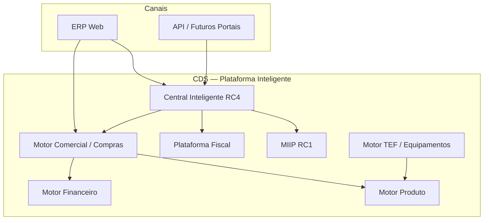
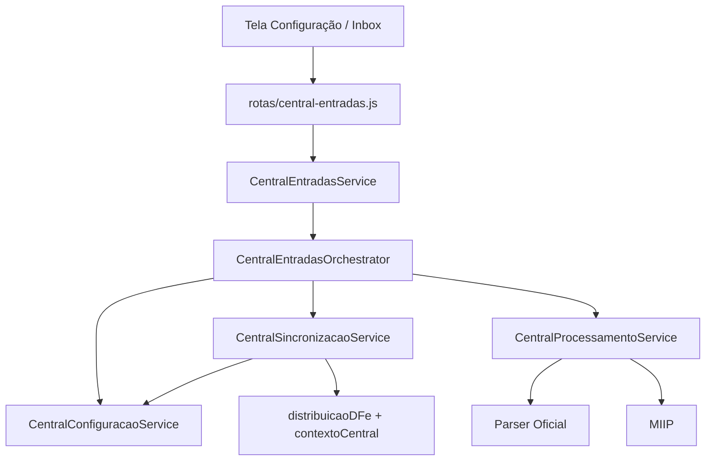
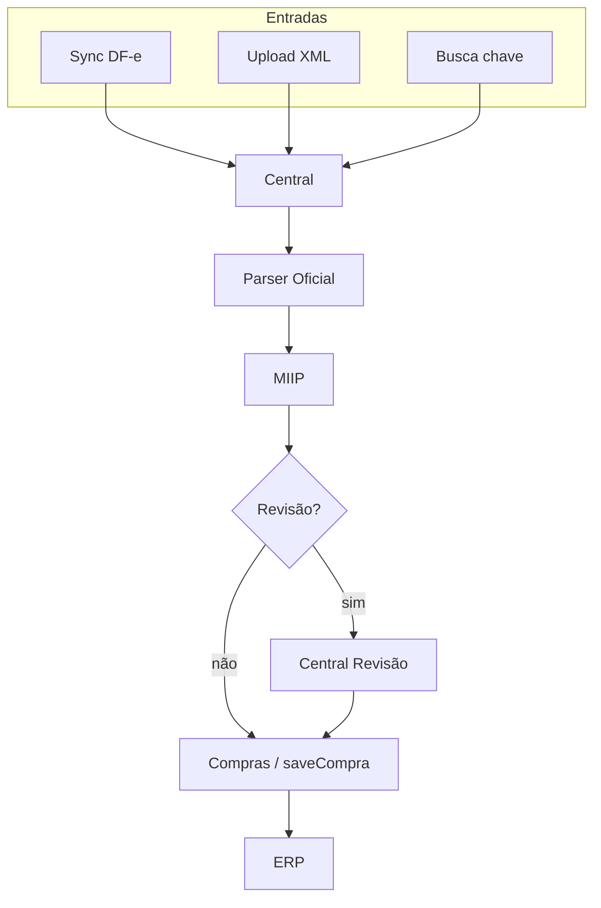
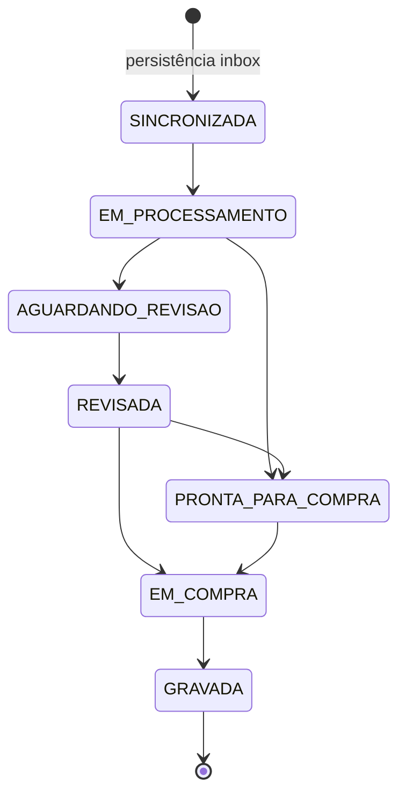

# CDS Sistemas

# Arquitetura Oficial

| Campo | Valor |
|---|---|
| **Documento** | Arquitetura Oficial CDS Sistemas |
| **Versão** | **1.0** |
| **Status** | **OFICIAL** |
| **Tipo** | Constituição Arquitetural |
| **Data de publicação** | 2026-07-10 |
| **Congelamentos de referência** | MIIP `1.0 RC1` · Central Inteligente `1.0 RC4` · Hardening **RC5** |
| **Escopo** | Documentação — **não** implementa funcionalidade, **não** altera código, banco, rotas ou regras de negócio |

> **Força normativa:** Nenhuma Sprint futura poderá contrariar esta documentação sem **revisão arquitetural formal**.

---

## Índice

1. [Visão Geral](#capítulo-1--visão-geral)
2. [Princípios da Plataforma](#capítulo-2--princípios-da-plataforma)
3. [Motores Oficiais](#capítulo-3--motores-oficiais)
4. [MIIP](#capítulo-4--miip)
5. [Central Inteligente](#capítulo-5--central-inteligente)
6. [Pipelines Oficiais](#capítulo-6--pipelines-oficiais)
7. [Orchestrators](#capítulo-7--orchestrators)
8. [Máquinas de Estado](#capítulo-8--máquinas-de-estado)
9. [Contratos Oficiais](#capítulo-9--contratos-oficiais)
10. [Regras Arquiteturais](#capítulo-10--regras-arquiteturais)
11. [Versões Oficiais](#capítulo-11--versões-oficiais)
12. [Diretrizes para Novos Módulos](#capítulo-12--diretrizes-para-novos-módulos)
13. [Roadmap Futuro](#capítulo-13--roadmap-futuro)
14. [Conclusão](#capítulo-14--conclusão)
15. [Glossário](#glossário)
16. [Histórico do Documento](#histórico-do-documento)
17. [Referências e Links](#referências-e-links)

---

## Capítulo 1 — Visão Geral

### 1.1 Definição oficial

O **CDS Sistemas** é uma **Plataforma Inteligente de Gestão Empresarial**.

Deixa de ser descrito apenas como “um ERP”. É uma plataforma composta por **motores especializados**, **pipelines únicos**, **orquestração centralizada** e **contratos estáveis**, capazes de evoluir para portais, APIs, marketplace e inteligência artificial sem refatorações estruturais.

### 1.2 Princípios da arquitetura

| Princípio | Significado |
|---|---|
| **Baixo acoplamento** | Módulos conversam por contratos públicos (facades, DTOs, eventos), não por detalhes internos |
| **Alta coesão** | Cada motor concentra uma responsabilidade clara |
| **Motores especializados** | Fiscal, MIIP, Central, Equipamentos, Comercial etc. não misturam papéis |
| **Pipeline único** | Um fluxo oficial por domínio — sem atalhos paralelos |
| **Reutilização** | Parser, MIIP, Central e Fiscal são reutilizados; não duplicados |
| **Escalabilidade** | Novos canais (portais, API, apps) consomem os mesmos motores |

### 1.3 Objetivos

1. Garantir **uma porta oficial** para documentos fiscais de entrada (Central Inteligente).
2. Garantir **uma identificação oficial** de produtos (MIIP).
3. Garantir **um parser oficial** de XML fiscal.
4. Isolar a **plataforma fiscal** (transporte SEFAZ) das regras de negócio do ERP.
5. Permitir evolução contínua sem quebrar contratos congelados (MIIP RC1, Central RC4).

### 1.4 Mapa conceitual da plataforma



---

## Capítulo 2 — Princípios da Plataforma

Estes princípios são **obrigatórios** para qualquer evolução.

| # | Princípio | Descrição oficial |
|---|---|---|
| P01 | **Responsabilidade Única** | Cada serviço/motor tem um papel; não acumula papéis de outros motores |
| P02 | **Orquestração centralizada** | Fluxos de domínio passam por Orchestrator / Facade oficiais |
| P03 | **Sem fluxos paralelos** | Proibido criar segundo pipeline para o mesmo objetivo |
| P04 | **Reutilização obrigatória** | Antes de criar, reutilizar Parser, MIIP, Central, Fiscal, DTOs |
| P05 | **Eventos padronizados** | Emissão via emissores oficiais (`centralEventosEmitter`, eventos MIIP/Equipamentos) |
| P06 | **Contratos estáveis** | APIs internas e DTOs não mudam sem versionamento |
| P07 | **DTOs oficiais** | Entrada/saída entre camadas usa contratos em `contracts/` |
| P08 | **Health Checks** | Módulos críticos expõem health (`/health`, painéis de diagnóstico) |
| P09 | **Diagnósticos** | Observabilidade operacional sem alterar regras de negócio |
| P10 | **Logs centralizados** | Formato padronizado por domínio (`[Central Entradas]`, `[FISCAL:…]`, MIIP) |

### 2.1 Camadas padrão

```
HTTP / UI
    ↓
Facade (Service de fachada)
    ↓
Orchestrator
    ↓
Services especializados
    ↓
Repositories / Adapters
    ↓
Persistência / SEFAZ / Hardware
```

---

## Capítulo 3 — Motores Oficiais

### 3.1 Catálogo

| Motor | Pasta / área | Versão de referência | Estado |
|---|---|---|---|
| Central Inteligente de Entradas | `backend/motores/central-entradas/` | `1.0.0-rc4` | **Congelada (RC4)** |
| MIIP | `backend/motores/miip/` | `1.0.0-rc1` | **Congelado (RC1)** |
| Plataforma Fiscal | `backend/services/fiscal/` (+ `core/`) | F10 / RC1.1 | Operacional (plataforma) |
| Motor Comercial (Compras / Vendas) | `backend/rotas/compras.js`, serviços comerciais | ERP core | Operacional |
| Motor Financeiro | Contas, recebimentos, financeiro | ERP core | Operacional |
| Motor Produto | Cadastro, estoque, preços | ERP core | Operacional |
| Motor TEF / Equipamentos | `backend/motores/equipamentos/` | Motor dedicado | Operacional |
| Parser Oficial | `NFeParserService` / shared nfe | `1.0` | Oficial |

### 3.2 Fichas por motor

#### Central Inteligente de Entradas

| Campo | Conteúdo |
|---|---|
| **Objetivo** | Única porta oficial de documentos fiscais de entrada |
| **Responsabilidade** | Sync DF-e, upload, busca por chave, processamento, revisão, bridge para Compras, configuração enterprise |
| **Entradas** | SEFAZ DF-e, XML upload, chave de acesso, ações de UI/API |
| **Saídas** | Documentos no inbox, eventos, notificações, vínculo com compra |
| **Dependências** | Parser Oficial, MIIP, Plataforma Fiscal (transporte DF-e), Compras (bridge) |
| **Estado atual** | Congelada |
| **Versão** | `1.0 RC4` |
| **Doc** | [CENTRAL_ENTRADAS_ARQUITETURA.md](./CENTRAL_ENTRADAS_ARQUITETURA.md) |

#### MIIP — Motor Inteligente de Identificação de Produtos

| Campo | Conteúdo |
|---|---|
| **Objetivo** | Identificar produto interno a partir de item externo |
| **Responsabilidade** | Pipeline de 6 engines, Decision, Explain, Learning, telemetria |
| **Entradas** | Item parseado / contexto (CNPJ, cProd, GTIN, descrição) |
| **Saídas** | Decisão, score, explicação, persistência em `miip_decisoes` |
| **Dependências** | ProdutoRepository, configs JSON; **não** parseia XML; **não** grava compra |
| **Estado atual** | Congelado |
| **Versão** | `1.0 RC1` |
| **Doc** | [ARQUITETURA_MIIP.md](./ARQUITETURA_MIIP.md) |

#### Plataforma Fiscal

| Campo | Conteúdo |
|---|---|
| **Objetivo** | Transporte e resolução de webservices SEFAZ |
| **Responsabilidade** | Registry, UrlResolver, SoapTransport, runtimes (status, DF-e, cancelamento, autorização…) |
| **Entradas** | Operações fiscais (XML/SOAP já montados pelo emissor/Central) |
| **Saídas** | Resposta SEFAZ, métricas, fallback legado |
| **Dependências** | Certificado, config fiscal de emitente |
| **Estado atual** | Operacional (RC1 / RC1.1) |
| **Versão** | `F10-autorizacao` / plataforma RC1 |
| **Doc** | [FISCAL_PLATFORM.md](./FISCAL_PLATFORM.md) |

#### Motor Comercial

| Campo | Conteúdo |
|---|---|
| **Objetivo** | Operações de compra e venda no ERP |
| **Responsabilidade** | `saveCompra()`, vendas, estoque comercial; **não** importa XML diretamente |
| **Entradas** | Dados de compra/venda; vínculo via Central (`vincularCompra`) |
| **Saídas** | Persistência comercial, impacto em estoque/financeiro |
| **Dependências** | Produto, Financeiro; Central para documentos de entrada |
| **Estado atual** | Operacional |
| **Versão** | ERP core |

#### Motor Financeiro

| Campo | Conteúdo |
|---|---|
| **Objetivo** | Contas a pagar/receber, recebimentos, lançamentos |
| **Responsabilidade** | Ciclo financeiro pós-operação comercial |
| **Entradas** | Eventos/lançamentos do Comercial |
| **Saídas** | Títulos, baixas, extratos |
| **Dependências** | Comercial, cadastros |
| **Estado atual** | Operacional |
| **Versão** | ERP core |

#### Motor Produto

| Campo | Conteúdo |
|---|---|
| **Objetivo** | Cadastro e ciclo de vida do produto |
| **Responsabilidade** | Produtos, preços, lotes, categorias |
| **Entradas** | Cadastro manual, decisões MIIP (associação), importações controladas |
| **Saídas** | Catálogo interno consumido por MIIP, Comercial, Equipamentos |
| **Dependências** | Persistência SQLite |
| **Estado atual** | Operacional |
| **Versão** | ERP core |

#### Motor TEF / Equipamentos

| Campo | Conteúdo |
|---|---|
| **Objetivo** | Integração com balanças, impressoras, TEF e periféricos |
| **Responsabilidade** | Drivers, transportes, sync de departamentos/produtos/etiquetas |
| **Entradas** | Comandos do ERP, catálogo de produtos |
| **Saídas** | Comunicação com hardware, logs de equipamento |
| **Dependências** | Motor Produto; contratos em `equipamentos/contracts` |
| **Estado atual** | Operacional |
| **Versão** | Motor dedicado |
| **Doc** | `backend/motores/equipamentos/README.md` |

#### Parser Oficial

| Campo | Conteúdo |
|---|---|
| **Objetivo** | Única forma oficial de interpretar XML de NF-e/NFC-e de entrada |
| **Responsabilidade** | Parse estruturado → JSON de domínio |
| **Entradas** | XML |
| **Saídas** | Estrutura parseada para Central / MIIP |
| **Dependências** | Nenhuma regra de compra ou SEFAZ |
| **Estado atual** | Oficial |
| **Versão** | `1.0` |

---

## Capítulo 4 — MIIP

**Status:** Congelado  
**Versão:** `1.0 RC1` (`1.0.0-rc1`)

Documentação detalhada: [ARQUITETURA_MIIP.md](./ARQUITETURA_MIIP.md) · [MIIP_RC1_RELEASE_NOTES.md](./MIIP_RC1_RELEASE_NOTES.md) · [MIIP_RC1_BENCHMARK.md](./MIIP_RC1_BENCHMARK.md)

### 4.1 Pipeline oficial (6 motores)

| Prioridade | Código | Papel |
|---|---|---|
| 10 | `motor_canonical` | Texto → `CanonicalProduct` |
| 20 | `motor_attribute_extractor` | → `SemanticProduct` |
| 30 | `motor_synonyms` | Sinônimos (JSON) |
| 40 | `motor_gtin` | Match EAN/GTIN |
| 50 | `motor_associacao_fornecedor` | CNPJ + cProd |
| 60 | `motor_similarity` | Similaridade semântica |

### 4.2 Decision · Explain · Learning

| Componente | Responsabilidade |
|---|---|
| **Decision Engine** | Único decisor (`DecisionEngine`) |
| **Explain Engine** | Toda decisão possui explicação (`MiipExplainService`) |
| **Learning** | Aprendizado só com confirmação explícita (`MiipLearningService`) — fora do pipeline automático |

### 4.3 Central Revisão · Parser · Telemetria · Health

| Tema | Posição oficial |
|---|---|
| **Parser** | Fora do MIIP — Parser Oficial; MIIP consome item já parseado |
| **Central Revisão** | UX/utilitários de revisão na Central; identificação continua no MIIP |
| **Telemetria** | Por execução (in-memory) + persistência de decisões |
| **Health** | `GET /api/miip/health` e audit readiness |
| **Benchmark RC1** | [MIIP_RC1_BENCHMARK.md](./MIIP_RC1_BENCHMARK.md) |

### 4.4 Diagrama MIIP


**Entrada única:** `MiipService`. Rotas e outros módulos **não** chamam engines ou `DecisionEngine` diretamente.

---

## Capítulo 5 — Central Inteligente

**Status:** Congelada  
**Versão:** `1.0 RC4` (`1.0.0-rc4`)

Documentação detalhada: [CENTRAL_ENTRADAS_ARQUITETURA.md](./CENTRAL_ENTRADAS_ARQUITETURA.md)

### 5.1 Arquitetura RC4

Padrão: **Facade → Orchestrator → Services → Repositories**

| Capacidade | Componente |
|---|---|
| Orquestração | `CentralEntradasOrchestrator` (singleton) |
| Fachada HTTP | `CentralEntradasService` |
| Pipeline documento | `CentralProcessamentoService` (Parser → MIIP → Status) |
| Persistência inbox | `CentralDfePersistenciaService` |
| Upload Enterprise | `CentralUploadService` |
| Sincronização | `CentralSincronizacaoService` + background |
| Configuração | `CentralConfiguracaoService` (ponto único RC4) |
| Diagnóstico / Health | `CentralDiagnosticoService` |
| Eventos | `centralEventosEmitter` |
| Máquina de estados | `MaquinaEstadosDocumento` + `DocumentoTransitionService` |

### 5.2 Configuração Enterprise (RC4)

Toda configuração operacional da Central passa por `CentralConfiguracaoService`:

Ambiente · SEFAZ (timeouts / visão de endpoints via UrlResolver) · Certificado (visão) · Sincronização · Diagnóstico · Avançado

**Regra:** a Central **não** hardcoda nem edita endpoints SOAP SEFAZ. O SOAP DF-e resolve exclusivamente via Plataforma Fiscal (`distribuicaoDfeRuntime` → `UrlResolver` → Registry). Timeouts/ambiente operacional passam por `CentralConfiguracaoService`.

### 5.3 Diagrama Central RC4



---

## Capítulo 6 — Pipelines Oficiais

### 6.1 Documento fiscal de entrada (único)

```
SEFAZ (DF-e)
    ↓
Central Inteligente
    ↓
Parser Oficial
    ↓
MIIP
    ↓
Central Revisão (quando necessário)
    ↓
Compras (bridge)
    ↓
saveCompra()
    ↓
ERP
```

### 6.2 Upload XML

```
Upload XML
    ↓
Central Inteligente
    ↓
Mesmo pipeline (Parser → MIIP → … → Compras)
```

### 6.3 Busca por chave

```
Consulta por chave
    ↓
Central Inteligente
    ↓
Mesmo pipeline
```

### 6.4 Regra absoluta

> **Nenhum fluxo paralelo é permitido** para o mesmo objetivo.  
> Compras **não** importa XML diretamente.  
> Identificação **não** bypassa o MIIP.  
> Parse **não** bypassa o Parser Oficial.



---

## Capítulo 7 — Orchestrators

### 7.1 Catálogo oficial

| Orchestrator | Módulo | Responsabilidade |
|---|---|---|
| `CentralEntradasOrchestrator` | Central | Único coordenador dos fluxos de negócio da Central |
| `MiipOrchestrator` | MIIP | Delega execução ao `MiipPipeline` |

### 7.2 Quem pode chamar

| Chamador | Pode chamar |
|---|---|
| Facades oficiais (`CentralEntradasService`, `MiipService`) | Sim |
| Rotas HTTP do domínio (via facade) | Sim |
| Bridge Compras → `vincularCompra` no Orchestrator da Central | Sim (contrato documentado) |
| Background services do próprio domínio | Sim, via Orchestrator/services oficiais |

### 7.3 Quem não pode chamar

| Proibido | Motivo |
|---|---|
| UI chamar repositories/engines diretamente | Quebra camadas |
| Compras chamar engines MIIP / DecisionEngine | Deve usar `MiipService` / enriquecimento oficial |
| Qualquer módulo criar “mini-orchestrator” paralelo | Viola P02/P03 |
| Rotas fiscais de entrada contornar a Central | Viola porta única |

---

## Capítulo 8 — Máquinas de Estado

### 8.1 Central — Documento fiscal

Fonte: `MaquinaEstadosDocumento` + `DocumentoFiscalStatus`  
Transições (exceto insert inicial) passam por `DocumentoTransitionService`.

```
RECEBIDA (reservado)
  → SINCRONIZADA | DUPLICADA | ERRO

SINCRONIZADA
  → EM_PROCESSAMENTO | DESCARTADA | DUPLICADA | ERRO

EM_PROCESSAMENTO
  → AGUARDANDO_REVISAO | PRONTA_PARA_COMPRA | ERRO

AGUARDANDO_REVISAO
  → REVISADA | DESCARTADA | ERRO

REVISADA
  → PRONTA_PARA_COMPRA | EM_COMPRA | DESCARTADA

PRONTA_PARA_COMPRA
  → EM_COMPRA | DESCARTADA

EM_COMPRA
  → GRAVADA | PRONTA_PARA_COMPRA

ERRO → SINCRONIZADA
GRAVADA / DESCARTADA / DUPLICADA → (terminais)
```



### 8.2 Regras

1. Estados terminais não transitam.
2. Não existe atalho `EM_PROCESSAMENTO → REVISADA` (removido na consolidação RC3).
3. Insert inicial de inbox pode gravar `SINCRONIZADA`/`DUPLICADA` sem TransitionService (exceção documentada).

---

## Capítulo 9 — Contratos Oficiais

### 9.1 Camadas de contrato

| Camada | Papel | Exemplos |
|---|---|---|
| **DTOs** | Dados estáveis entre camadas | `SincronizacaoResultadoDTO`, `ProcessamentoResultadoDTO`, `DecisaoIdentificacaoDTO`, DTOs de Equipamentos |
| **Eventos** | Observabilidade e auditoria | `TIPOS_EVENTO` Central, eventos MIIP/Equipamentos |
| **Facades** | Porta pública do motor | `CentralEntradasService`, `MiipService` |
| **Controllers** | HTTP fino | `CentralConfiguracaoController` |
| **Services** | Regras de domínio do motor | Processamento, Sync, Config, Learning |
| **Repositories** | Persistência | `CentralDocumentosRepository`, `MiipDecisoesRepository` |

### 9.2 Padrão de dependência

```
Controller / Rota
    → Facade
        → Orchestrator
            → Service
                → Repository / Adapter externo
```

Contratos públicos vivem em `contracts/`. Detalhes internos de engines **não** são API pública.

---

## Capítulo 10 — Regras Arquiteturais

Registro oficial — **obrigatório**:

| # | Regra |
|---|---|
| R01 | Todo XML utiliza o **Parser Oficial** |
| R02 | Toda identificação de produto utiliza o **MIIP** |
| R03 | Todo documento fiscal de entrada entra pela **Central Inteligente** |
| R04 | Nenhuma Compra importa XML diretamente |
| R05 | Nenhum módulo cria pipeline paralelo |
| R06 | Nenhuma configuração operacional da Central fica espalhada |
| R07 | Toda configuração da Central passa por **serviços oficiais** (`CentralConfiguracaoService`) |
| R08 | Toda integração entre motores utiliza **contratos públicos** |
| R09 | `saveCompra()` não é alterado por sprints de infraestrutura da Central/MIIP/Fiscal sem revisão formal |
| R10 | Alterar MIIP RC1 ou Central RC4 exige **nova versão** e aprovação arquitetural |

---

## Capítulo 11 — Versões Oficiais

| Componente | Versão oficial | Status |
|---|---|---|
| **Arquitetura CDS** | **1.0** | **OFICIAL** (este documento) |
| **MIIP** | **1.0 RC1** | Congelado |
| **Central Inteligente** | **1.0 RC4** | Congelada |
| **Parser Oficial** | **1.0** | Oficial |
| **Upload Enterprise** | **1.0** | Oficial (Central) |
| **Plataforma Fiscal** | F10 / RC1.1 | Operacional |

### 11.1 Matriz de congelamento

| Artefato | Pode evoluir sem revisão formal? |
|---|---|
| MIIP comportamento / pipeline | **Não** |
| Central pipeline / estados / config ownership | **Não** |
| Docs derivados alinhados a este documento | Sim |
| Novos portais consumindo contratos existentes | Sim (Cap. 12–13) |
| Novo motor com pipeline paralelo de entrada fiscal | **Não** |

---

## Capítulo 12 — Diretrizes para Novos Módulos

Todo novo módulo deverá:

1. **Respeitar** a Arquitetura Oficial v1.0.
2. **Utilizar** os motores existentes (Central, MIIP, Fiscal, Parser, Comercial).
3. **Evitar duplicação** de parse, identificação, sync SEFAZ ou configuração.
4. **Utilizar eventos** padronizados do domínio.
5. **Utilizar DTOs** e facades oficiais.
6. **Utilizar serviços oficiais** — não acessar repositories de outro motor diretamente.
7. **Não criar dependências circulares** (ex.: MIIP não depende da Central; a Central consome o MIIP).
8. Expor **health** quando for módulo crítico.
9. Documentar contratos públicos antes de integrar UI/API.

### 12.1 Checklist de revisão arquitetural

- [ ] Há pipeline paralelo? → rejeitar
- [ ] Contorna Central / MIIP / Parser? → rejeitar
- [ ] Lê config espalhada? → rejeitar
- [ ] Depende de detalhe interno de outro motor? → rejeitar
- [ ] Contratos e eventos definidos? → exigir

---

## Capítulo 13 — Roadmap Futuro

Preparação arquitetural (não implementada neste documento):

| Frente | Direção |
|---|---|
| Portal do Contador | Consumir Central + Fiscal via API/contratos |
| Portal do Cliente | Canal sobre Comercial / Financeiro |
| Portal do Vendedor | Canal sobre Comercial / Produto |
| CT-e / MDF-e / NFS-e | Extensões de documento — **entrada pela Central** quando aplicável |
| Marketplace | Reuso de Produto + Comercial + MIIP |
| API Pública | Facades versionadas |
| Aplicativos | Mesmos contratos da API |
| BI | Leitura de eventos e repositórios analíticos |
| Inteligência Artificial | Extensões sobre MIIP / telemetria — sem quebrar Decision Engine RC1 |

Itens já **preparados estruturalmente** na Central RC4 (não funcionais): manifestação, proxy, multi-CNPJ/filiais.

---

## Capítulo 14 — Conclusão

Fica registrado oficialmente que:

1. O **CDS Sistemas** deixa de ser apenas um ERP.
2. Passa a ser uma **Plataforma Inteligente de Gestão Empresarial**.
3. Os pilares congelados desta constituição são o **MIIP 1.0 RC1** e a **Central Inteligente 1.0 RC4**.
4. Toda evolução futura deverá **respeitar a Arquitetura Oficial v1.0**.
5. Qualquer exceção exige **revisão arquitetural formal** e atualização versionada deste documento.

---

## Glossário

| Termo | Definição |
|---|---|
| **CIE** | Central Inteligente de Entradas |
| **MIIP** | Motor Inteligente de Identificação de Produtos |
| **Parser Oficial** | Único interpretador oficial de XML fiscal de entrada |
| **Pipeline** | Sequência oficial e única de processamento de um domínio |
| **Orchestrator** | Coordenador central dos serviços de um motor |
| **Facade** | Porta pública do motor para HTTP/outros módulos |
| **DTO** | Objeto de transferência de dados com contrato estável |
| **DF-e** | Distribuição de Documentos Fiscais Eletrônicos (SEFAZ) |
| **RC** | Release Candidate — congelamento arquitetural |
| **Contexto Central** | Pacote operacional (`obterContextoOperacional`) para sync/SOAP |
| **Bridge Compras** | Integração oficial Central → abertura/vínculo de compra |
| **Plataforma Fiscal** | Camada de transporte/resolução SEFAZ (`FiscalWebServices`) |

---

## Histórico do Documento

| Versão | Data | Descrição |
|---|---|---|
| **1.0** | **2026-07-10** | Publicação oficial após congelamento MIIP RC1 e Central RC4 |

---

## Referências e Links

### Documentos oficiais de domínio

| Documento | Escopo |
|---|---|
| [ARQUITETURA_MIIP.md](./ARQUITETURA_MIIP.md) | Arquitetura MIIP RC1 |
| [MIIP_RC1_RELEASE_NOTES.md](./MIIP_RC1_RELEASE_NOTES.md) | Release notes MIIP |
| [MIIP_RC1_BENCHMARK.md](./MIIP_RC1_BENCHMARK.md) | Benchmark RC1 |
| [MIIP_READINESS_REPORT.md](./MIIP_READINESS_REPORT.md) | Prontidão MIIP |
| [MIIP_DECISION_ENGINE.md](./MIIP_DECISION_ENGINE.md) | Decision Engine |
| [MIIP_EXPLAIN.md](./MIIP_EXPLAIN.md) | Explain |
| [MIIP_APRENDIZADO.md](./MIIP_APRENDIZADO.md) | Learning |
| [MIIP_TELEMETRIA.md](./MIIP_TELEMETRIA.md) | Telemetria |
| [MIIP_CENTRAL_REVISAO.md](./MIIP_CENTRAL_REVISAO.md) | Central Revisão |
| [CENTRAL_ENTRADAS_ARQUITETURA.md](./CENTRAL_ENTRADAS_ARQUITETURA.md) | Central RC4 |
| [FISCAL_PLATFORM.md](./FISCAL_PLATFORM.md) | Plataforma Fiscal |

### Código de referência (somente leitura neste documento)

| Caminho | Papel |
|---|---|
| `backend/motores/central-entradas/` | Central Inteligente |
| `backend/motores/miip/` | MIIP |
| `backend/motores/equipamentos/` | Equipamentos / TEF |
| `backend/services/fiscal/` | Plataforma Fiscal |
| `backend/rotas/central-entradas.js` | HTTP Central |
| `docs/ARQUITETURA_OFICIAL_CDS_V1.md` | **Este documento — Constituição Arquitetural** |

---

## Confirmação de publicação

| Item | Status |
|---|---|
| Arquivo `docs/ARQUITETURA_OFICIAL_CDS_V1.md` | **Publicado** |
| Versão | **1.0** |
| Status | **OFICIAL** |
| Índice | Presente |
| Capítulos 1–14 | Presentes |
| Diagramas Mermaid | Visão geral, MIIP, Central, Pipeline, Estados |
| Tabelas / Glossário / Histórico / Links | Presentes |
| Alteração de código / banco / rotas / regras | **Nenhuma** (somente documentação) |

**A Arquitetura Oficial v1.0 do CDS Sistemas está publicada e passa a ser a referência arquitetural obrigatória do projeto.**
