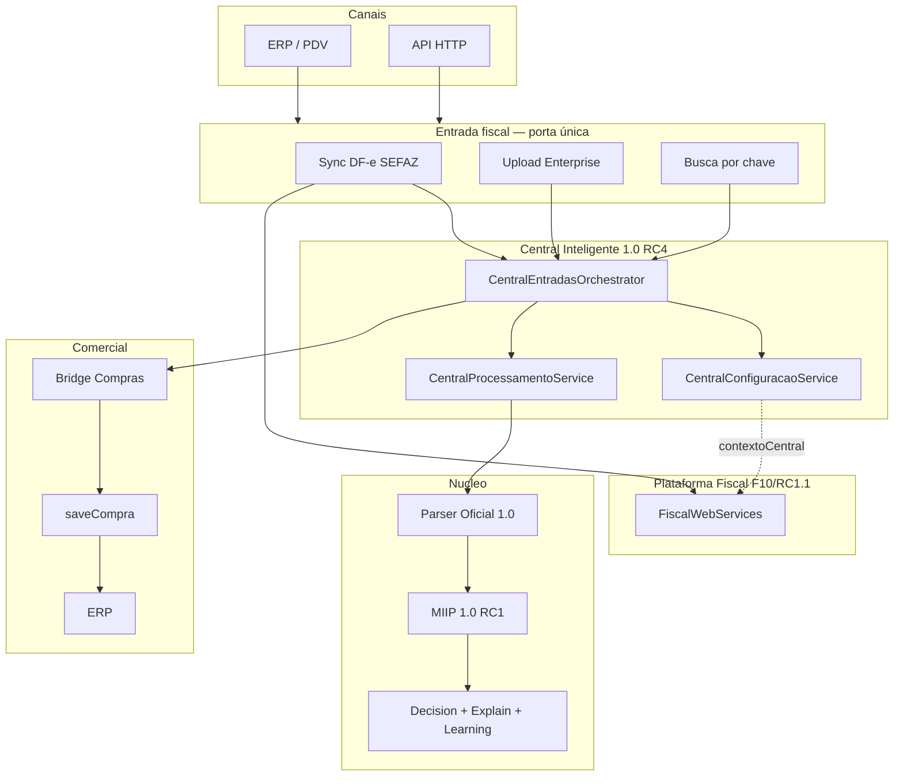

# AUDITORIA FINAL — CDS SISTEMAS V1

| Campo | Valor |
|---|---|
| **Documento** | Auditoria oficial de encerramento da Arquitetura V1 |
| **Data** | 2026-07-10 |
| **Escopo** | Validação — **sem** implementação, **sem** refatoração |
| **Referências** | MIIP RC1 · Central RC4 · Arquitetura Oficial v1.0 |
| **Changelog** | [CHANGELOG_ARQUITETURAL.md](./CHANGELOG_ARQUITETURAL.md) |
| **Constituição** | [ARQUITETURA_OFICIAL_CDS_V1.md](./ARQUITETURA_OFICIAL_CDS_V1.md) |

---

## 1. Resumo executivo

A plataforma CDS Sistemas foi auditada após o congelamento do **MIIP 1.0 RC1**, da **Central Inteligente 1.0 RC4** e da publicação da **Arquitetura Oficial v1.0**.

**Veredito:** a arquitetura V1 está **consolidada e aprovada para evolução**. Existem **dívidas residuais documentadas** (média/baixa), nenhuma delas invalida a unicidade dos pilares oficiais (Parser, Pipeline, Central, MIIP, Decision/Explain/Learning, Configuração Enterprise, fluxo de Compras).

---

## 2. Fluxograma atualizado (estado V1)



---

## 3. Matriz de versões

| Componente | Versão oficial | Status | Evidência |
|---|---|---|---|
| **Arquitetura CDS** | **1.0** | OFICIAL | `docs/ARQUITETURA_OFICIAL_CDS_V1.md` |
| **MIIP** | **1.0 RC1** (`1.0.0-rc1`) | Congelado | `MiipService` / `MiipOrchestrator` / docs MIIP |
| **Central Inteligente** | **1.0 RC4** (`1.0.0-rc4`) | Congelada | `VERSAO_MODULO` no Orchestrator |
| **Parser Oficial** | **1.0** | Oficial | `backend/shared/nfe/NFeParserService.js` |
| **Upload Enterprise** | **1.0** | Oficial | `CentralUploadService` |
| **Plataforma Fiscal** | F10 / RC1.1 | Operacional | `docs/FISCAL_PLATFORM.md` |
| **package.json** | `1.0.3` | Empacotamento app | Distinto da versão arquitetural 1.0 |

---

## 4. Lista de documentos oficiais

| Documento | Papel |
|---|---|
| [ARQUITETURA_OFICIAL_CDS_V1.md](./ARQUITETURA_OFICIAL_CDS_V1.md) | Constituição Arquitetural |
| [CHANGELOG_ARQUITETURAL.md](./CHANGELOG_ARQUITETURAL.md) | Histórico arquitetural |
| [ARQUITETURA_MIIP.md](./ARQUITETURA_MIIP.md) | Arquitetura MIIP RC1 |
| [MIIP_RC1_RELEASE_NOTES.md](./MIIP_RC1_RELEASE_NOTES.md) | Release Notes MIIP |
| [MIIP_RC1_BENCHMARK.md](./MIIP_RC1_BENCHMARK.md) | Benchmark RC1 |
| [MIIP_READINESS_REPORT.md](./MIIP_READINESS_REPORT.md) | Readiness MIIP |
| [MIIP_READINESS_REPORT_FINAL.md](./MIIP_READINESS_REPORT_FINAL.md) | Readiness final |
| [CENTRAL_ENTRADAS_ARQUITETURA.md](./CENTRAL_ENTRADAS_ARQUITETURA.md) | Arquitetura Central RC4 |
| [FISCAL_PLATFORM.md](./FISCAL_PLATFORM.md) | Plataforma Fiscal |
| Este arquivo | Auditoria de encerramento V1 |

---

## 5. Auditoria — Arquitetura (unicidade)

| Verificação | Resultado | Evidência |
|---|---|---|
| Apenas um Parser Oficial | **PASS** | `NFeParserService` + `NFeParser` (shared/nfe); outros “parsers” são de domínio distinto (DF-e retorno, Toledo) |
| Apenas um Pipeline Oficial de entrada | **PASS** | `CentralProcessamentoService` (Parser → MIIP → status) |
| Apenas um Upload Oficial | **PASS** | `CentralUploadService`; Compras upload → HTTP 410 |
| Apenas uma Central Inteligente | **PASS** | `backend/motores/central-entradas/` + Orchestrator singleton |
| Apenas um MIIP | **PASS** | `backend/motores/miip/` + `MiipService` |
| Apenas um Decision Engine | **PASS** | `core/DecisionEngine.js` via `MiipDecisionBuilder` |
| Apenas um Explain Engine | **PASS** | `core/MiipExplainService.js` |
| Apenas um Learning Service | **PASS** | `services/MiipLearningService.js` |
| Apenas um Configuration Provider da Central | **PASS com ressalva** | Provider oficial: `CentralConfiguracaoService`; ainda existe `CentralConfigService` como camada de sync/compat (ver achados) |
| Apenas um fluxo oficial de Compras (entrada) | **PASS** | Bridge → `saveCompra` → `Orchestrator.vincularCompra`; upload legado 410 |

---

## 6. Auditoria — Motores (responsabilidade única)

| Motor | Responsabilidade única | Nota |
|---|---|---|
| Plataforma Fiscal | Transporte/resolução SEFAZ | 9.0 |
| Motor Comercial | Compras/vendas; não importa XML de entrada | 8.5 |
| Motor Produto | Cadastro/estoque/preços | 8.5 |
| Motor Financeiro | Títulos/recebimentos | 8.0 |
| Motor TEF / Equipamentos | Periféricos/drivers | 8.0 |
| MIIP | Identificação de produtos | 9.5 |
| Central Inteligente | Porta de entrada fiscal | 9.5 |
| Parser Oficial | Interpretação XML de entrada | 9.5 |

---

## 7. Auditoria — Dependências

| Tema | Achado |
|---|---|
| Dependências circulares MIIP ↔ Central | **Não encontradas** — Central consome MIIP; MIIP não importa Central |
| Chamadas proibidas (Compras → engines MIIP) | **Não encontradas** no caminho oficial |
| Acoplamento Diagnóstico → `soapClient` | **Documentado** (exceção operacional de teste DF-e) |
| Acesso fiscal via Config Central | Adapter interno em `CentralConfiguracaoService` (path/senha certificado) — conforme RC4 |
| Duplicação de config sync | `CentralConfigService` ainda usado por background/execução (compat) |
| Código morto / @deprecated | Repos MIIP sinonimos/estatísticas; DTOs equipamentos re-export; rotas DF-e 410 |
| TODO / FIXME | TODOs em Equipamentos (transportes/monitor/discovery) e TEF SDK — preparação futura, não bloqueantes V1 |
| Arquivos órfãos críticos | Nenhum órfão crítico nos pilares V1 |

---

## 8. Auditoria — Documentação

| Par | Consistência |
|---|---|
| Arquitetura Oficial ↔ MIIP RC1 | **OK** |
| Arquitetura Oficial ↔ Central RC4 | **OK** |
| Arquitetura Oficial ↔ Fiscal | **OK** |
| Central README módulo | **Desatualizado** — ainda cita `1.0.0-rc3` |
| Release Notes / Benchmark MIIP | **OK** (`1.0.0-rc1`) |
| Readiness gerado | **Parcialmente obsoleto** — métricas de execução zeradas em relatório gerado |
| Versionamento app (`1.0.3`) vs arquitetura (`1.0`) | **Esquemas distintos** — aceitável se documentado |

---

## 9. Auditoria — Testes

Suítes executadas nesta auditoria (exit code 0):

| Suíte | Resultado |
|---|---|
| `npm run test:central-integridade` | **PASS** (inclui estados, sprints, RC1–RC4) |
| `npm run test:fiscal` | **PASS** (última bateria autorização 13/13; suíte agregada verde) |
| `npm run test:miip` | **PASS** (suíte agregada; telemetria 41/41; paridade 5/5) |
| `npm run test:nfe-parser` | **PASS** 6/6 |
| `npm run test:danfe-itens-venda` | **PASS** 5/5 |
| `npm run test:dfe-retorno-parser` | **PASS** 6/6 |
| `npm run test:conversao-unidades` | **PASS** 15/15 |
| `npm run test:tef-fluxo` | **PASS** 13/13 |
| `npm run test:equipamentos-contracts` | **PASS** 28/28 |

| Métrica | Valor |
|---|---|
| Scripts `test:*` no `package.json` | **68** |
| Falhas nas suítes executadas nesta auditoria | **0** |
| Cobertura formal (Istanbul/nyc) | **Não instrumentada** no projeto — cobertura = suítes de regressão por domínio |

> Observação: a suíte completa `test:equipamentos` (todos os drivers/TCP) não foi reexecutada integralmente nesta rodada; contratos Equipamentos passaram. Dívida de cobertura de hardware permanece operacional, não arquitetural.

---

## 10. Auditoria — Performance / redundâncias

| Tema | Avaliação |
|---|---|
| Pipelines duplicados de entrada | **Não** — pipeline único certificado |
| Queries duplicadas | Risco residual em dashboards/diagnóstico (agregações repetidas) — **médio/baixo** |
| Eventos duplicados | Contrato RC3: sync consolida notificação — **OK** |
| Health duplicado | Vários health por domínio (Central, MIIP, Fiscal metrics) — **esperado**; não é pipeline paralelo |
| Logs duplicados | Formatos padronizados por domínio — **OK** |
| Serviços redundantes | `CentralConfigService` + `CentralConfiguracaoService` — **compat layer** (ver achados) |

---

## 11. Auditoria — Segurança / rotas

| Item | Status |
|---|---|
| Rotas DF-e legadas | **HTTP 410** (`backend/rotas/dfe.js`) |
| Upload XML em Compras | **HTTP 410** |
| Endpoints mortos sem 410 | Não identificados nos pilares de entrada |
| Serviços privados / facades | Padrão Facade → Orchestrator respeitado nos motores V1 |
| Exposição de senha de certificado | Diagnóstico/Config mostram apenas flags/visão — **OK** nos testes RC2 |

---

## 12. Achados (somente listagem — sem correção)

### Crítico

*Nenhum.*

### Alto

*Nenhum bloqueante para encerramento V1.*

### Médio

1. **Drift documental:** `backend/motores/central-entradas/README.md` ainda declara `1.0.0-rc3` enquanto o código/docs oficiais estão em RC4.
2. **Camada dupla de config sync:** `CentralConfigService` permanece usado por `CentralSyncBackgroundService` / `CentralSyncExecucaoService` em paralelo ao provider oficial `CentralConfiguracaoService` (compat RC4 — risco de divergência se alguém gravar só em um lado).
3. **Diagnóstico DF-e via `soapClient`:** bypass da Fiscal Platform no teste de comunicação (exceção já documentada na Central/Fiscal).
4. **Relatório de readiness MIIP gerado** com métricas de execução zeradas / texto desatualizado em relação à suíte real.

### Baixo

1. Repositórios MIIP `@deprecated` ainda no tree (`MiipSinonimosRepository`, `MiipEstatisticasRepository`).
2. Re-exports `@deprecated` em `equipamentos/dto/*`.
3. TODOs de Sprint futura em transportes Equipamentos e adapters TEF SDK.
4. Tabelas legadas `notas_recebidas*` e leitura em `exportarContabilidadeService` (migração futura documentada).
5. `nfeDevolucaoCompra` permanece em caminho legado SOAP (fora do escopo de entrada Central; classificado na Fiscal Platform).
6. Versionamento `package.json` `1.0.3` ≠ Arquitetura `1.0` (esquemas diferentes).

---

## 13. Notas (parecer quantitativo)

| Dimensão | Nota (0–10) | Comentário |
|---|---|---|
| **MIIP** | **9.5** | Congelado, pipeline único, testes fortes |
| **Central Inteligente** | **9.3** | RC4 config + pipeline; drift README e dual config sync |
| **Parser Oficial** | **9.5** | Unicidade clara |
| **Plataforma Fiscal** | **9.0** | RC1.1 consolidada; exceções legado documentadas |
| **Comercial / Compras** | **8.7** | Fluxo oficial via Central; 410 no upload legado |
| **Equipamentos / TEF** | **8.0** | Contratos OK; TODOs de hardware/SDK |
| **Arquitetura** | **9.4** | Constituição v1.0 + unicidade validada |
| **Documentação** | **8.8** | Forte no núcleo; drift pontual README/readiness |
| **Escalabilidade** | **9.0** | Pronta para portais/API sobre contratos |
| **Organização** | **9.1** | Motores/facades/orchestrators claros |
| **Reutilização** | **9.3** | Parser/MIIP/Central/Fiscal reutilizados |
| **Plataforma (geral)** | **9.2** | Aprovada para evolução |

---

## 14. Confidence Score

| Item | Score |
|---|---|
| **Confidence Score da auditoria** | **93%** |
| Fatores positivos | Unicidade dos pilares, testes verdes nas suítes-chave, docs oficiais alinhados, 410 em rotas legadas |
| Fatores de desconto | Dual config sync, drift README Central, readiness gerado stale, suíte equipamentos completa não reexecutada nesta rodada |

---

## 15. Parecer Final

```
CDS SISTEMAS
PLATAFORMA INTELIGENTE DE GESTÃO
VERSÃO 1.0

STATUS:
ARQUITETURA OFICIAL CONSOLIDADA
APROVADA PARA EVOLUÇÃO
```

### Declarações oficiais

1. A **Arquitetura V1** do CDS Sistemas está **encerrada estruturalmente**.
2. Os congelamentos **MIIP RC1** e **Central RC4** permanecem válidos.
3. A **Arquitetura Oficial v1.0** é a constituição normativa.
4. Achados médios/baixos são **dívida residual documentada**, não impeditivos.
5. **Nenhuma nova Sprint estrutural** deve iniciar sem **revisão arquitetural formal**.

### Entregáveis desta auditoria

1. `docs/CHANGELOG_ARQUITETURAL.md`
2. `docs/AUDITORIA_FINAL_CDS_V1.md` (este relatório)
3. Fluxograma atualizado (Seção 2)
4. Matriz de versões (Seção 3)
5. Lista de documentos oficiais (Seção 4)
6. Resumo executivo (Seção 1)
7. Confidence Score **93%** (Seção 14)
8. Parecer Final (esta seção)

---

**Auditoria concluída em 2026-07-10. Arquitetura V1 oficialmente consolidada.**
