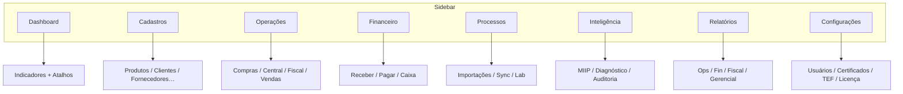

# AUDITORIA DE UX/UI — PADRONIZAÇÃO DA NAVEGAÇÃO

**Produto:** CDS Sistemas  
**Escopo:** ERP + PDV (frontend)  
**Data:** 2026-07-10  
**Tipo:** Auditoria — **sem implementação de funcionalidades**  
**Referência arquitetural:** [ARQUITETURA_OFICIAL_CDS_V1.md](./ARQUITETURA_OFICIAL_CDS_V1.md)

---

## Índice

1. [Diagnóstico Geral](#1-diagnóstico-geral)
2. [Lista de inconsistências por módulo](#2-lista-de-inconsistências-por-módulo)
3. [Plano de Correção](#3-plano-de-correção)
4. [Proposta de Novo Mapa de Navegação](#4-proposta-de-novo-mapa-de-navegação)
5. [Componentes Reutilizáveis](#5-componentes-reutilizáveis)
6. [Design System — oportunidades](#6-design-system--oportunidades)
7. [Relatório Executivo](#7-relatório-executivo)
8. [Padrão Oficial de Navegação (normativo)](#8-padrão-oficial-de-navegação-normativo)

---

## Fontes auditadas

| Fonte | Caminho |
|---|---|
| Menu ERP | `frontend/erp/index.html` |
| Menu PDV | `frontend/pdv/index.html` |
| Roteamento SPA | `frontend/shared/js/core.js`, `frontend/erp/js/app.js`, `frontend/pdv/js/app.js` |
| Permissões | `frontend/shared/js/access-control.js` |
| Layout base | `frontend/css/style.css` |
| Módulos com CSS próprio | `financeiro.css`, `pdv.css`, `central-*.css`, `miip-*.css` |

**Achado estrutural:** não existe arquivo de configuração de menu (JSON). A navegação é **HTML estático** + `data-page` + `loadPage()` **sem hash/URL**.

---

## 1. Diagnóstico Geral

### Pontos fortes

- Shell único (sidebar escura + `#page-content`) compartilhado entre ERP e PDV.
- Dashboard global do ERP com indicadores e atalhos.
- Financeiro já possui abas internas com Dashboard próprio.
- Central Inteligente possui inbox com KPIs (dashboard operacional embutido).
- Controle de permissões e implantação (`data-recurso`) já filtram itens do menu.
- Font Awesome + Bootstrap como base comum.

### Problemas encontrados

| Categoria | Severidade | Exemplos |
|---|---|---|
| Menu flat sem grupos | Alta | ~20 itens ERP em lista única |
| Itens duplicados / alias | Alta | Estoque = Produtos; PDV Sangria = Fechamento |
| Nomenclatura inconsistente | Alta | “Relatórios / Vendas” vs Histórico de Vendas |
| Inteligência espalhada | Alta | MIIP só em Compras/Central; Diagnóstico no topo |
| Cadastros misturados com operações | Alta | Produtos/Clientes no mesmo nível que Compras/Caixa |
| Configurações fragmentadas | Média | Config · Avançadas · Usuários · Licença · Lab · Equipamentos |
| Relatórios não centralizados | Média | Vendas no menu; Relatórios financeiros só dentro do Financeiro |
| Dashboards ausentes por módulo | Média | Compras, Fiscal, Produtos abrem direto em lista/cadastro |
| Ícones repetidos / ambíguos | Baixa | `fa-cash-register` em Caixa e Abrir PDV |
| CSS por módulo sem tokens | Média | Central/Financeiro/MIIP com linguagens visuais distintas |
| Sem breadcrumb / deep-link | Média | URL não reflete a tela; difícil compartilhar estado |
| PDV com itens enganosos | Alta | NFC-e e TEF não levam a módulos reais |

### Nível de consistência

| Dimensão | Nota (0–100) |
|---|---|
| Estrutura de navegação vs padrão oficial | **28%** |
| Agrupamento semântico | **35%** |
| Nomenclatura | **45%** |
| Dashboards por módulo | **25%** |
| Consistência visual (ícones/espaçamento) | **50%** |
| Fluxo / cliques | **40%** |
| **Consistência geral estimada** | **≈ 38%** |

---

## 2. Lista de inconsistências por módulo

### 2.1 ERP — Navegação global

| # | Inconsistência | Tipo |
|---|---|---|
| E1 | Menu **flat** — sem seções Dashboard / Cadastros / Operações / … | Agrupamento |
| E2 | **Estoque** e **Produtos** apontam para o mesmo `data-page="produtos"` | Duplicação |
| E3 | Cadastros (Produtos, Categorias, Clientes, Fornecedores) intercalados com Operações | Agrupamento |
| E4 | **Relatórios / Vendas** é histórico de vendas, não centro de relatórios | Nomenclatura |
| E5 | **Fechamento de Caixa** no mesmo nível que Configurações (deveria ser Financeiro/Operações) | Agrupamento |
| E6 | **Usuários**, **Licença**, **Lab. Equipamentos**, **Config. Avançadas** fora de Configurações | Agrupamento |
| E7 | **Auditoria** no menu raiz (candidato a Inteligência ou Configurações) | Agrupamento |
| E8 | **Diagnóstico Central** no topo (candidato a Inteligência) | Agrupamento |
| E9 | **Central Inteligente** no topo junto a Compras (ok como Operação/Processo, mas sem grupo) | Agrupamento |
| E10 | Ícone `fa-cash-register` duplicado (Caixa × Abrir PDV) | Visual |
| E11 | Sem breadcrumb; sem sincronização URL ↔ tela | Fluxo |
| E12 | Permissão Dashboard = `relatorios` (nome desalinhado) | Consistência |

### 2.2 Cadastros

| # | Inconsistência | Tipo |
|---|---|---|
| C1 | Não existe seção **Cadastros** | Estrutura |
| C2 | Faltam no menu (podem existir só em formulários): Marcas, Unidades, Tributação, Transportadoras, Centros de Custo, Contas, Funcionários | Cobertura |
| C3 | Categorias no menu; Subcategorias só dentro do fluxo de categorias | Escondido |
| C4 | Equipamentos/Balanças acessíveis via Configurações/Dashboard, não via Cadastros/Config unificado | Caminhos múltiplos |

### 2.3 Operações

| # | Inconsistência | Tipo |
|---|---|---|
| O1 | Compras e Vendas (histórico) no mesmo nível flat | Agrupamento |
| O2 | Venda real ocorre no **PDV**, não no ERP — expectativa do usuário pode confundir | Fluxo |
| O3 | Inventário / Transferências / Produção / Pedidos — não mapeados no menu atual | Cobertura |
| O4 | Central de Entradas é operação/processo fiscal, mas visualmente “solta” | Agrupamento |

### 2.4 Financeiro

| # | Inconsistência | Tipo |
|---|---|---|
| F1 | Módulo bem estruturado internamente (abas) — **referência positiva** | — |
| F2 | Caixa / Fechamento / Gerenciar Caixas **fora** do módulo Financeiro | Agrupamento |
| F3 | Relatórios financeiros só dentro do Financeiro; não há hub Relatórios | Relatórios |
| F4 | CSS próprio (`financeiro.css`) diverge do restante do ERP | Visual |

### 2.5 Processos

| # | Inconsistência | Tipo |
|---|---|---|
| P1 | Não existe seção **Processos** | Estrutura |
| P2 | Importação XML / Sync DF-e / Upload vivem dentro de Compras e Central | Escondido |
| P3 | Lab. Equipamentos é processo técnico no menu raiz | Agrupamento |
| P4 | Sincronizações da Central ficam em Config da Central (ok), mas sem hub Processos | Agrupamento |

### 2.6 Inteligência

| # | Inconsistência | Tipo |
|---|---|---|
| I1 | **MIIP não aparece no menu** — só em Compras (cards) e modal de revisão | Escondido |
| I2 | Diagnóstico Central no menu raiz (deveria ser Inteligência) | Agrupamento |
| I3 | Auditoria no menu raiz (parcialmente Inteligência / Compliance) | Agrupamento |
| I4 | Sugestões MIIP misturadas à UI de Compras (`miip-compras.css`) | Visual / Agrupamento |

### 2.7 Relatórios

| # | Inconsistência | Tipo |
|---|---|---|
| R1 | Não existe hub **Relatórios** | Estrutura |
| R2 | “Relatórios / Vendas” = histórico operacional | Nomenclatura |
| R3 | Relatórios financeiros na aba do Financeiro | Fragmentação |
| R4 | Dashboard global mistura indicadores com atalhos (bom), mas não substitui Relatórios | Fluxo |

### 2.8 Configurações

| # | Inconsistência | Tipo |
|---|---|---|
| K1 | Três entradas: Configurações · Config. Avançadas · itens soltos | Fragmentação |
| K2 | Usuários / Permissões fora de Configurações | Agrupamento |
| K3 | Licença no menu raiz | Agrupamento |
| K4 | Certificado fiscal: Config Avançadas + aba Certificado da Central | Caminhos múltiplos |
| K5 | Impressoras / TEF / Rede espalhados | Agrupamento |

### 2.9 Fiscal

| # | Inconsistência | Tipo |
|---|---|---|
| X1 | Fiscal ERP = NFC-e emitidas / emissão manual — sem Dashboard do módulo | Dashboard |
| X2 | Central Entradas e Fiscal são irmãos no menu, sem agrupamento “Fiscal/Entradas” | Agrupamento |
| X3 | Permissão da Central = `compras` (semântico estranho para o usuário) | Consistência |

### 2.10 PDV

| # | Inconsistência | Tipo |
|---|---|---|
| D1 | Sangria/Suprimento e Fechamento → mesmo `caixa` | Duplicação |
| D2 | NFC-e → mesma página da Venda (`pdv`) | Enganoso |
| D3 | TEF → toast + redireciona reimpressão; fora de `PERMISSOES_PAGINAS` | Fluxo / Bug UX |
| D4 | Clientes no PDV (cadastro) misturado a operações de caixa | Agrupamento |
| D5 | Config Rede / Nome PDV escondidos (ok), mas fora de Configurações unificadas | Agrupamento |
| D6 | PDV não carrega CSS dos módulos ERP (ok para performance), mas componentes compartilhados divergem | Visual |

### 2.11 Dashboards ausentes

| Módulo | Abre em | Deveria abrir em |
|---|---|---|
| Produtos / Estoque | Lista/cadastro | Dashboard do módulo |
| Compras | Lista | Dashboard (pendências, últimas NFs, atalhos) |
| Vendas (ERP) | Histórico | Dashboard + relatórios |
| Fiscal | Lista NFC-e | Dashboard fiscal |
| Clientes / Fornecedores | Lista | Dashboard do cadastro (opcional leve) |
| Configurações | Formulário longo | Hub de configurações com cards |
| PDV | Venda (aceitável) | Venda como “home” do PDV — exceção justificada |

---

## 3. Plano de Correção

### P0 — Crítico (bloqueia padrão oficial)

| ID | Ação | Resultado esperado |
|---|---|---|
| P0.1 | Introduzir **grupos oficiais** no sidebar ERP (e PDV adaptado) | Navegação previsível |
| P0.2 | Remover duplicata **Estoque** ou transformá-la em visão real de estoque | Fim do alias enganoso |
| P0.3 | Corrigir PDV: unificar Caixa; remover/relabel NFC-e e TEF enganosos | Expectativa = destino |
| P0.4 | Criar seção **Inteligência** e mover MIIP + Diagnóstico (+ Auditoria se aplicável) | Inteligência centralizada |
| P0.5 | Definir documento normativo de navegação (este arquivo, Cap. 8) como obrigatório V2+ | Governança UX |

### P1 — Importante

| ID | Ação | Resultado esperado |
|---|---|---|
| P1.1 | Agrupar Cadastros / Operações / Financeiro / Processos / Relatórios / Configurações | Menu alinhado ao padrão |
| P1.2 | Mover Caixa / Gerenciar Caixas para Financeiro (ou Operações de caixa) | Financeiro completo |
| P1.3 | Consolidar Configurações (Usuários, Licença, Avançadas, Equipamentos) | Um hub |
| P1.4 | Hub Relatórios (Operacionais / Financeiros / Fiscais / Gerenciais) | Relatórios centralizados |
| P1.5 | Dashboard por módulo crítico (Compras, Fiscal, Central, Produtos) | Nunca abrir só em grid |
| P1.6 | Breadcrumb + `hash` ou query `?page=` | Deep-link e orientação |
| P1.7 | Alinhar permissões semânticas (Central ≠ só `compras`) | ACL compreensível |

### P2 — Melhorias

| ID | Ação | Resultado esperado |
|---|---|---|
| P2.1 | Design tokens (cores, espaçamento, tipografia) compartilhados | Identidade única |
| P2.2 | Unificar padrões de grid/filtro/formulário | Menos CSS por módulo |
| P2.3 | Ícones únicos por função; guia de iconografia | Menos ambiguidade |
| P2.4 | Contagem de cliques: atalhos no Dashboard global e nos dashboards de módulo | Menos atrito |
| P2.5 | Extrair menu para config declarativa (JSON/JS) | Manutenção e testes |

---

## 4. Proposta de Novo Mapa de Navegação

### 4.1 ERP (mapa alvo)

```
Dashboard                          → dashboard global

Cadastros
  ├─ Produtos
  ├─ Categorias / Subcategorias
  ├─ Clientes
  ├─ Fornecedores
  ├─ (Funcionários)*
  ├─ (Marcas / Unidades / Tributação)*
  └─ Transportadoras / Centros de Custo / Contas*

Operações
  ├─ Compras
  ├─ Central Inteligente de Entradas
  ├─ Histórico de Vendas
  ├─ Fiscal (NFC-e)
  └─ (Inventário / Ajustes / Transferências)*

Financeiro
  ├─ Dashboard Financeiro
  ├─ Contas a Receber
  ├─ Contas a Pagar
  ├─ Caixa / Sangria / Suprimento / Fechamento
  ├─ Gerenciar Caixas*
  └─ Fluxo / Conciliação*

Processos
  ├─ Importação / Upload XML
  ├─ Sincronização DF-e
  ├─ Lab. Equipamentos
  └─ (Filas / Agendamentos)*

Inteligência
  ├─ MIIP (hub)
  ├─ Central de Revisão MIIP
  ├─ Diagnóstico Central
  ├─ Auditoria
  └─ (Sugestões / Indicadores inteligentes)

Relatórios
  ├─ Operacionais
  ├─ Financeiros
  ├─ Fiscais
  └─ Gerenciais

Configurações
  ├─ Preferências / Sistema
  ├─ Usuários e Permissões
  ├─ Integrações (TEF, Rede, Pix)
  ├─ Fiscal / Certificados
  ├─ Impressoras / Equipamentos
  ├─ Licença
  └─ Config. Avançadas (SUPER_ADMIN)

[Ação] Abrir PDV
```

`*` = item futuro ou hoje parcial — **não implementar nesta sprint**; apenas reservar no mapa.

### 4.2 PDV (mapa alvo)

```
Operações
  ├─ Venda (home)
  ├─ Consulta de Preço
  └─ Reimpressão de Cupom

Financeiro (caixa)
  └─ Caixa (sangria, suprimento, fechamento — uma tela com abas)

Cadastros (mínimo)
  └─ Clientes (atalho)

Configurações (SUPER_ADMIN)
  ├─ Nome deste PDV
  └─ Rede

[Ação] Abrir ERP
```

Remover ou relabel: NFC-e (integrar à Venda), TEF (integrar ao pagamento — não item de menu fantasma).

### 4.3 Diagrama (ERP)



---

## 5. Componentes Reutilizáveis

| Componente | Situação atual | Unificação proposta |
|---|---|---|
| Shell sidebar | Duplicado ERP/PDV HTML | Template único + config de itens |
| Page header (título + ações) | Cada módulo inventa o seu | `ModuleHeader` |
| KPI cards | Dashboard, Financeiro, Central | `KpiCard` / `KpiRow` |
| Abas internas | Financeiro (custom), Central (custom), Fiscal (Bootstrap) | `ModuleTabs` |
| Grids / tabelas | Bootstrap tables ad hoc | `DataTable` padrão (filtros, paginação, empty state) |
| Filtros de período | Dashboard e Financeiro diferentes | `PeriodFilter` |
| Formulários CRUD | Produtos/Clientes/Fornecedores estilos distintos | `FormPage` + `FormSection` |
| Empty / loading / error | Spinners e textos variados | `StatePanel` |
| Modais de confirmação | Vários padrões | `ConfirmModal` |
| Breadcrumb | Inexistente | `Breadcrumb` ligado ao mapa |

---

## 6. Design System — oportunidades

### Tokens sugeridos

| Token | Uso |
|---|---|
| `--cds-sidebar-bg` | Sidebar |
| `--cds-space-1..6` | Espaçamentos |
| `--cds-radius` | Cards/botões |
| `--cds-font-title` / `--cds-font-body` | Tipografia |
| `--cds-color-primary/success/danger/warning` | Semântica |
| `--cds-card-shadow` | Elevação |

### Telas candidatas a template único

1. **Lista CRUD** (Produtos, Clientes, Fornecedores, Categorias)  
2. **Dashboard de módulo** (KPIs + atalhos + últimos + pendências)  
3. **Hub de Configurações** (cards por domínio)  
4. **Console de Inteligência** (MIIP + Diagnóstico)  
5. **Histórico / Relatório** (filtros + grid + export)

### CSS a consolidar gradualmente

- Manter `style.css` como base.  
- Absorver padrões de `financeiro.css` e `central-*.css` em tokens + componentes.  
- Evitar novos CSS “ilha” por feature sem passar pelo design system.

---

## 7. Relatório Executivo

### Nível atual de padronização

**≈ 38%** de aderência ao Padrão Oficial de Navegação proposto.

O CDS possui base técnica sólida (shell, permissões, módulos fortes como Financeiro e Central), mas a **IA de navegação** ainda é uma lista plana histórica, com inteligência e configurações espalhadas.

### Ganhos esperados (após correção P0+P1)

| Área | Ganho |
|---|---|
| UX | Menos confusão; usuário encontra Cadastro vs Operação vs Config |
| Cliques | −20% a −40% em fluxos frequentes (atalhos + grupos) |
| Treinamento | Onboarding mais rápido (mapa mental único) |
| Manutenção | Menu declarativo + componentes = menos HTML duplicado |
| Escalabilidade V2 | Novos módulos encaixam no padrão sem reinventar sidebar |

### Impacto na experiência

- Previsibilidade: “sempre Configurações no final; sempre Inteligência junta”.  
- Confiança: itens de menu fazem o que o rótulo promete (fim de NFC-e/TEF fantasmas no PDV).  
- Profissionalismo: identidade visual única reforça a marca Plataforma Inteligente.

### Impacto na manutenção do código

- Hoje: menus hardcoded em 2 `index.html` + loaders espalhados.  
- Alvo: config de navegação + componentes → mudanças de IA/UX sem caçar strings em HTML.

### Recomendações

1. Adotar o **Capítulo 8** como norma UX (junto à Arquitetura Oficial V1).  
2. Executar P0 em uma sprint de **navegação** (sem features).  
3. Em seguida P1 (hubs + dashboards de módulo).  
4. Design system incremental (P2) em paralelo a V2.  
5. Não criar novos itens de menu fora dos 8 grupos oficiais.

---

## 8. Padrão Oficial de Navegação (normativo)

A ordem abaixo passa a ser o **padrão oficial do CDS Sistemas** para todos os módulos atuais e futuros:

```
Dashboard
Cadastros
Operações
Financeiro        (quando aplicável)
Processos         (quando aplicável)
Inteligência
Relatórios
Configurações
```

### Regras

1. Todo módulo deve ter **Dashboard** (ou herdar o global com atalhos do módulo).  
2. **Nunca** abrir o módulo diretamente em tela de cadastro como home.  
3. Cadastros **somente** em Cadastros.  
4. Movimentações **somente** em Operações.  
5. Financeiro **não** mistura cadastros.  
6. Inteligência (MIIP, diagnósticos, auditorias inteligentes) **centralizada**.  
7. Relatórios **centralizados** e classificados.  
8. Configurações **concentradas** (usuários, certificados, integrações, impressoras).  
9. PDV segue o mesmo vocabulário, com home = Venda (exceção operacional justificada).  
10. Novos itens de menu exigem encaixe em um dos 8 grupos — senão, revisão UX formal.

---

## Inventário atual do menu (referência)

### ERP (ordem atual)

1. Dashboard  
2. Produtos  
3. Categorias  
4. Estoque *(alias de Produtos)*  
5. Compras  
6. Central Inteligente de Entradas  
7. Diagnóstico Central  
8. Clientes  
9. Fornecedores  
10. Financeiro  
11. Relatórios / Vendas  
12. Fiscal  
13. Configurações  
14. Usuários  
15. Lab. Equipamentos  
16. Licença  
17. Auditoria  
18. Fechamento de Caixa  
19. Config. Avançadas  
20. Gerenciar Caixas  
21. Abrir PDV  

### PDV (ordem atual)

1. Venda  
2. Consulta de Preço  
3. Clientes  
4. Sangria / Suprimento  
5. Fechamento de Caixa *(mesmo destino que 4)*  
6. NFC-e *(mesmo destino que Venda)*  
7. TEF *(fluxo quebrado / enganoso)*  
8. Reimpressão de Cupom  
9. Nome deste PDV  
10. Configuração de Rede  
11. Abrir ERP  

---

## Conclusão

A auditoria confirma que o CDS Sistemas **precisa de uma reorganização de navegação** para alcançar o nível de plataforma consolidado na Arquitetura V1.

**Não foram implementadas funcionalidades nesta sprint.**  
O entregável é o diagnóstico, o plano priorizado e o **Padrão Oficial de Navegação**, que deverá orientar todas as evoluções de UI a partir de agora.

**Próximo passo sugerido (fora desta auditoria):** Sprint de implementação P0 — somente reorganização de menus e rótulos, sem novas features de negócio.
