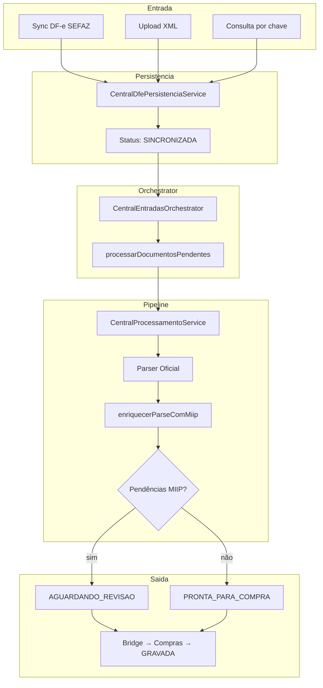

# Central Inteligente de Entradas — Arquitetura RC4

**Versão:** `1.0.0-rc4` (evolução RC1–RC3)  
**Módulo:** `backend/motores/central-entradas/`

## Visão geral

A Central Inteligente de Entradas (CIE) é a **única porta oficial** de documentos fiscais de entrada no CDS Sistemas.

Padrão: **Facade → Orchestrator → Services → Repositories**

## Camadas

```
HTTP (rotas/central-entradas.js | compras.js → Orchestrator)
        ↓
CentralEntradasService          ← Fachada HTTP
        ↓
CentralEntradasOrchestrator     ← Orquestrador único (RC1–RC4)
        ↓
Services especializados
        ↓
Repositories (SQLite)
```

## Configuração Enterprise (RC4)

Ponto único: **`CentralConfiguracaoService`**.

```
Tela Configuração (6 abas)
        ↓
GET/PUT /api/central-entradas/configuracao
        ↓
CentralConfiguracaoController
        ↓
CentralConfiguracaoService
        ↓
CentralConfiguracaoRepository (central_entradas_config)
        ↓
CentralSincronizacao → SOAP DF-e (contextoCentral)
```

| Módulo | Conteúdo |
|---|---|
| Ambiente | Produção/Homologação, UF, metadados |
| SEFAZ | URLs DF-e / consulta / manifestação (prep), timeout, retries |
| Certificado | Visão (nome, CNPJ, validade, status) — path/senha via adapter fiscal |
| Sincronização | Auto, ao abrir, intervalo, janelas, max docs |
| Diagnóstico | Health, testes, versões, tempos |
| Avançado | HTTP timeout/retry, proxy (estrutura), debug |

**Regra:** nenhum serviço da Central lê URL/ambiente/timeout diretamente do Motor Fiscal nem hardcoda URL SEFAZ. Certificado físico permanece no cadastro fiscal; a Central só consome via `obterContextoOperacional()`.

Rotas: `GET|PUT /configuracao`, `POST .../testar-sefaz|testar-certificado|health|limpar-cache|restaurar`.

Sync HTTP: **nunca 502** — 200 / 422 (config) / 503 (SEFAZ) + `mensagemAmigavel`.

## Certificação — unicidade

| Pergunta | Resposta |
|---|---|
| Existe apenas um pipeline? | **Sim** — `CentralProcessamentoService` (Parser → MIIP → Status) |
| Existe apenas um orchestrator? | **Sim** — `CentralEntradasOrchestrator` (singleton) |
| Existe apenas uma máquina de estados? | **Sim** — `MaquinaEstadosDocumento` + `DocumentoTransitionService` |
| Existe apenas uma forma de importar? | **Sim** — `CentralDfePersistenciaService` (upload / DF-e / chave) |
| Existe apenas uma integração MIIP? | **Sim** — via `CentralProcessamentoService` |
| Existe apenas uma forma de criar compras? | **Sim** — Bridge → Compras; vínculo via Orchestrator |
| Existe apenas um fluxo de processamento? | **Sim** — `processar` / `processarDocumentosPendentes` |
| Existe apenas um serviço de configuração? | **Sim** — `CentralConfiguracaoService` (RC4) |

## Fluxo oficial unificado



## Máquina de estados

```
RECEBIDA (reservado)
  → SINCRONIZADA | DUPLICADA | ERRO

SINCRONIZADA
  → EM_PROCESSAMENTO | DESCARTADA | DUPLICADA | ERRO

EM_PROCESSAMENTO
  → AGUARDANDO_REVISAO | PRONTA_PARA_COMPRA | ERRO

AGUARDANDO_REVISAO
  → REVISADA | DESCARTADA | ERRO

REVISADA
  → PRONTA_PARA_COMPRA | EM_COMPRA | DESCARTADA

PRONTA_PARA_COMPRA
  → EM_COMPRA | DESCARTADA

EM_COMPRA
  → GRAVADA | PRONTA_PARA_COMPRA

ERRO → SINCRONIZADA
GRAVADA / DESCARTADA / DUPLICADA → (terminais)
```

Atualizações de status (exceto insert inicial) passam por `DocumentoTransitionService`.

## Eventos

Campos: `tipo`, `origem`, `descricao`, `resultado`, `sucesso`, `documentoId`, `usuarioId` (em detalhe), `duracaoMs` (tempo), `timestamp` (`created_at`).

Emissão única via `centralEventosEmitter.emitirEvento` (inclui sync).

Origens: `background`, `manual`, `api`, `sistema`, `abrir_central`, `diagnostico`, `upload`, `compras`.

## Notificações

Padrão único: `CentralNotificacoesService.criarPadrao`.

- Sync: **uma** notificação consolidada (`NOVAS_NOTAS` | `SYNC_CONCLUIDA` | `SYNC_ERRO`)
- Documento pronto / compra: notificações por documento (canais distintos, documentados)

## Indicadores

`GET /api/central-entradas/inteligencia` — calcula **alertas uma vez** e deriva operacional, pendências, atenção e alertas.

Endpoints legados (`/operacional`, `/alertas`, `/pendencias`, `/atencao`) permanecem.

## Logs

```
[Central Entradas][<AREA>] <ISO8601> | Campo: valor
```

## Integração Compras

`rotas/compras.js` → `CentralEntradasOrchestrator.vincularCompra` (singleton DI).

## Exceções documentadas

| Item | Motivo |
|---|---|
| Certificado path/senha | Fonte fiscal (cadastro); Central lê só via `CentralConfiguracaoService` |
| Insert inicial sem TransitionService | Persistência de inbox (SINCRONIZADA/DUPLICADA) |
| RECEBIDA | Estado reservado / default de `inserir` |
| Manifestação / Proxy / multi-CNPJ | Estrutura RC4 — não funcional |
| `CentralConfigService` | Adapter interno de sync (RC5) — provider oficial é `CentralConfiguracaoService` |

## Testes

```bash
npm run test:central-integridade
npm run test:central-entradas-rc4
```

Inclui estados, sprints 2–10, RC1–RC4.

## Performance (observações)

| Fluxo | Observação |
|---|---|
| Inteligência UX | 1× alertas (antes 3–4×) |
| Sync DF-e | Dominado por SEFAZ / SoapTransport; config via Central |
| Upload / Parser / MIIP | Pipeline único; reuso de `parseJson` |
| Dashboard | Contadores por status — OK |
