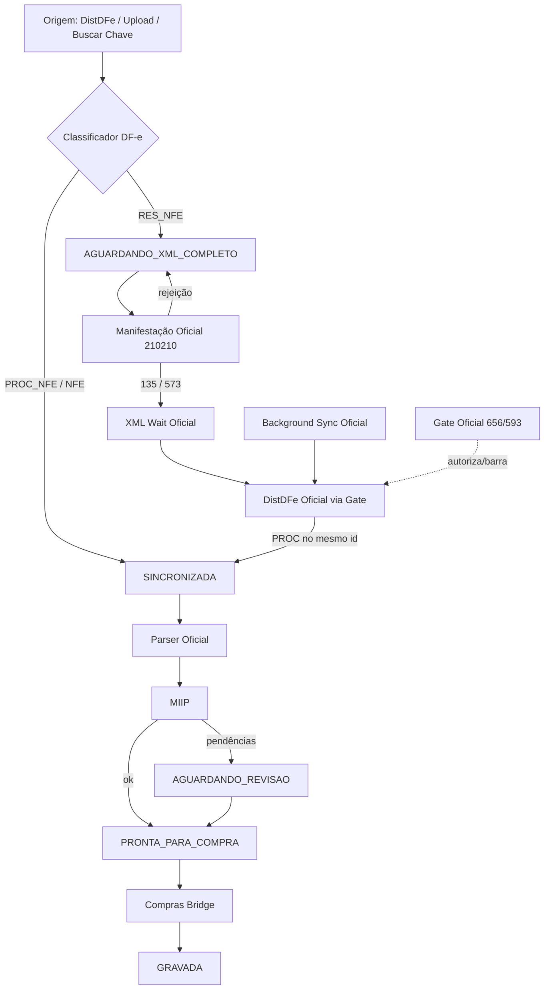

# CENTRAL DE ENTRADAS — V1 OFICIAL

| Campo | Valor |
|-------|-------|
| **Produto** | CDS Sistemas — Central Inteligente de Entradas |
| **Versão Oficial** | **V1.0** |
| **Status** | **CONGELADA** |
| **Data do Freeze** | 2026-07-19 |
| **Sprint de Freeze** | RC7.8 |
| **Base de auditoria** | RC7.6 (homologação) + RC7.7 (auditoria final) |
| **Confidence Score (RC7.7)** | 78% |

---

## Status: CONGELADA

A arquitetura da Central de Entradas V1.0 está **oficialmente congelada**.

- Alterações em itens **congelados** exigem sprint fiscal explícita + regressão SEFAZ.
- Correções P0 de estado (NSU/ambiente) e inclusão de `buscarPorChave` no Gate podem ocorrer sob governança operacional **sem** reabrir contrato fiscal.
- Novas funcionalidades de produto ficam para **V1.1+**.

---

## 1. Arquitetura Final

```
┌─────────────────────────────────────────────────────────────────┐
│  Frontend ERP                                                    │
│  central-entradas.js + central-entradas-ux.js (UX Oficial)       │
└────────────────────────────┬────────────────────────────────────┘
                             │ HTTP /api/central-entradas/*
┌────────────────────────────▼────────────────────────────────────┐
│  Rotas  backend/rotas/central-entradas.js                        │
│  Facade CentralEntradasService                                   │
│  Orchestrator Oficial: CentralEntradasOrchestrator               │
└───────┬──────────────┬──────────────┬──────────────┬────────────┘
        │              │              │              │
   Sync+Gate      Manifestação   Processamento    Upload/Compras
   Background     + Ciclo DF-e   Parser→MIIP      Bridge
   XmlWait
        │              │
        └──────┬───────┘
               ▼
┌──────────────────────────────────────────┐
│  Gate Oficial: CentralSefazOperationalGate│
│  Mutex DistDFe: CentralSyncExecucaoService │
└──────────────────┬───────────────────────┘
                   ▼
┌──────────────────────────────────────────┐
│  DistDFe Oficial / Manifestação Oficial  │
│  fiscal/distribuicaoDFe + runtimes       │
│  UrlResolver → Registry → SoapTransport  │
└──────────────────────────────────────────┘
```

**Camadas internas**

| Camada | Path |
|--------|------|
| Facade | `CentralEntradasService.js` |
| Orchestrator | `CentralEntradasOrchestrator.js` |
| Services | `services/*` |
| Core / estados | `core/*` |
| Contracts (DTOs) | `contracts/*` |
| Repositories | `repositories/*` |
| Config | `config/*` |
| Utils | `utils/*` |
| Controllers | `controllers/CentralConfiguracaoController.js` |

---

## 2. Fluxograma Final (Pipeline Oficial)



---

## 3. Componentes Marcados como OFICIAIS

| Papel Oficial | Componente canônico | Path |
|---------------|---------------------|------|
| **Pipeline Oficial** | Orchestrator + Processamento + Persistência DF-e | `CentralEntradasOrchestrator` + `CentralProcessamentoService` + `CentralDfePersistenciaService` |
| **Scheduler Oficial** | XmlWait Scheduler | `CentralXmlWaitScheduler.js` |
| **Background Oficial** | Sync Background | `CentralSyncBackgroundService.js` |
| **Gate Oficial** | SEFAZ Operational Gate | `CentralSefazOperationalGate.js` |
| **Dashboard Oficial** | Dashboard Central | `CentralDashboardService.js` + `CentralDashboardDTO.js` |
| **UX Oficial** | Inbox + helpers UX RC7.5 | `frontend/erp/js/central-entradas.js` + `central-entradas-ux.js` |
| **XML Wait Oficial** | Scheduler + estado KV | `CentralXmlWaitScheduler` + chave `xml_wait_scheduler_state` |
| **Parser Oficial** | NFeParser via Processamento | hook em `CentralProcessamentoService` → `NFeParserService` |
| **Manifestação Oficial** | Ciência 210210 | `CentralManifestacaoDfeService.js` + `manifestacaoRuntime` |
| **DistDFe Oficial** | Distribuição DF-e | `distribuicaoDFe.js` + `distribuicaoDfeRuntime.js` |

**Regra:** um único componente oficial por papel. Não criar segundo Gate, segundo XmlWait ou segundo Orchestrator.

---

## 4. Inventário Completo

### 4.1 Orchestrators

| Nome | Oficiais | Observação |
|------|----------|------------|
| `CentralEntradasOrchestrator` | **SIM — ÚNICO** | Coordenação sync, ciclo, upload, compras, health |

### 4.2 Schedulers

| Nome | Oficiais |
|------|----------|
| `CentralXmlWaitScheduler` | **SIM — Scheduler Oficial / XML Wait Oficial** |

### 4.3 Background Services

| Nome | Oficiais |
|------|----------|
| `CentralSyncBackgroundService` | **SIM — Background Oficial** (sobe XmlWait no boot) |

### 4.4 Gates

| Nome | Oficiais |
|------|----------|
| `CentralSefazOperationalGate` | **SIM — Gate Oficial único** |

Estados do circuit breaker: `NORMAL` \| `WARNING` \| `BLOCKED` \| `RECOVERING` \| `CONFIG_ERROR`.

### 4.5 Serviços (`services/`)

| Serviço | Responsabilidade |
|---------|------------------|
| `CentralSyncExecucaoService` | Mutex DistDFe + integração Gate + eventos SYNC_* |
| `CentralSyncBackgroundService` | Sync automática em background |
| `CentralXmlWaitScheduler` | Recuperação PROC pós-ciência |
| `CentralSefazOperationalGate` | Autorização DistDFe / 656 / 593 |
| `CentralSincronizacaoService` | Contexto + DistDFe / buscar chave |
| `CentralManifestacaoDfeService` | Ciência 210210 + ciclo pós-manifestação |
| `CentralDfePersistenciaService` | Upsert inbox RES/PROC |
| `CentralDocumentoAtualizacaoService` | Atualização RES→PROC mesmo id |
| `DocumentoDfeClassifier` | Classificação raiz XML |
| `CentralProcessamentoService` | Parser → MIIP → status |
| `CentralComprasBridgeService` | Payload / abrir / vincular compra |
| `CentralUploadService` | Upload XML |
| `CentralDocumentoService` | CRUD / listagem inbox |
| `DocumentoTransitionService` | Transições via máquina de estados |
| `CentralNsuService` | Hardening ultNSU/maxNSU |
| `CentralDashboardService` | KPIs + telemetria operacional |
| `CentralOperacionalDashboardService` | Painel operacional auxiliar |
| `CentralDiagnosticoService` | Diagnóstico / probe SEFAZ |
| `CentralConfiguracaoService` | Config enterprise + contexto fiscal |
| `CentralConfigService` | Adapter sync (intervalo/janelas) |
| `CentralEventosService` | Consulta eventos |
| `CentralHistoricoService` | Histórico de status |
| `CentralNotificacoesService` | Notificações UI |
| `CentralAlertasService` | Alertas |
| `CentralPendenciasService` | Pendências |
| `CentralAtencaoService` | Fila de atenção |
| `CentralScoreDocumentoService` | Score documento |
| `CentralScoreFornecedorService` | Score fornecedor |
| `CentralHomologacaoService` | Painel/métricas homologação |
| `CentralMigracaoLegadoService` | Migração legado (admin) |

### 4.6 DTOs (`contracts/`)

| DTO |
|-----|
| `CentralDashboardDTO` |
| `CentralFiltroDTO` |
| `CentralHistoricoEntryDTO` |
| `DocumentoFiscalDetalheDTO` |
| `DocumentoFiscalInboxDTO` |
| `ProcessamentoResultadoDTO` |
| `SincronizacaoResultadoDTO` |
| `UploadResultadoDTO` |

### 4.7 Eventos oficiais (`TIPOS_EVENTO`)

| Evento |
|--------|
| `SYNC_INICIADA` |
| `SYNC_CONCLUIDA` |
| `SYNC_ERRO` |
| `DOCUMENTO_RECEBIDO` |
| `DOCUMENTO_PROCESSADO` |
| `DOCUMENTO_ATUALIZADO` |
| `DOCUMENTO_MIGRADO` |
| `CIENCIA_ENVIADA` |
| `MANIFESTACAO_CLAIM` |
| `MANIFESTACAO_ACEITA` |
| `MANIFESTACAO_REJEITADA` |
| `CONSULTA_DFE_POS_MANIFESTACAO` |
| `PARSER_CONCLUIDO` |
| `MIIP_CONCLUIDO` |
| `COMPRA_GRAVADA` |
| `ERRO` |
| `CONFIG_ALTERADA` |

Origens: `background`, `manual`, `api`, `sistema`, `abrir_central`, `diagnostico`, `upload`, `compras`, `MIGRACAO_RC65`.

### 4.8 Estados de documento (`DocumentoFiscalStatus`)

| Status | Terminal? |
|--------|-----------|
| `RECEBIDA` | Não |
| `SINCRONIZADA` | Não |
| `EM_PROCESSAMENTO` | Não |
| `AGUARDANDO_REVISAO` | Não |
| `AGUARDANDO_XML_COMPLETO` | Não |
| `REVISADA` | Não |
| `PRONTA_PARA_COMPRA` | Não |
| `EM_COMPRA` | Não |
| `GRAVADA` | **Sim** |
| `DESCARTADA` | **Sim** |
| `ERRO` | Não |
| `DUPLICADA` | **Sim** |

Etapas observáveis do ciclo DF-e (`CicloDfeEstadosMap` — **não** são status de documento):  
`RES_NFE`, `CIENCIA_PENDENTE`, `CIENCIA_ENVIADA`, `AGUARDANDO_XML_COMPLETO`, `SINCRONIZADA`, `PROCESSADA`, `AGUARDANDO_REVISAO`, `PRONTA_PARA_COMPRA`, `GRAVADA`.

### 4.9 Tipos DF-e (`DocumentoDfeTipo`)

| Tipo | Raiz XML |
|------|----------|
| `RES_NFE` | `resNFe` |
| `PROC_NFE` | `nfeProc` |
| `NFE` | `NFe` |
| `PROC_EVENTO_NFE` | `procEventoNFe` |
| `RES_EVENTO` | `resEvento` |
| `DESCONHECIDO` | — |

### 4.10 API / Endpoints / Rotas

**Prefixo oficial:** `/api/central-entradas`  
**Auth:** token + recurso `fiscal`  
**Montagem:** `backend/server.js` → `backend/rotas/central-entradas.js`

| Método | Rota |
|--------|------|
| GET | `/health` |
| POST | `/admin/migrar-legado` |
| GET | `/diagnostico` |
| POST | `/diagnostico/health-check` |
| POST | `/diagnostico/acoes/sincronizar` |
| POST | `/diagnostico/acoes/reprocessar-pendencias` |
| POST | `/diagnostico/acoes/testar-certificado` |
| POST | `/diagnostico/acoes/testar-sefaz` |
| POST | `/diagnostico/acoes/limpar-cache` |
| GET | `/metadados` |
| GET | `/dashboard` |
| GET | `/alertas` |
| GET | `/pendencias` |
| GET | `/operacional` |
| GET | `/inteligencia` |
| GET | `/atencao` |
| GET | `/config` |
| PATCH | `/config` |
| GET | `/configuracao` |
| PUT | `/configuracao` |
| POST | `/configuracao/restaurar` |
| POST | `/configuracao/testar-sefaz` |
| POST | `/configuracao/testar-certificado` |
| POST | `/configuracao/health` |
| POST | `/configuracao/limpar-cache` |
| GET | `/servico/status` |
| GET | `/eventos` |
| GET | `/notificacoes` |
| PATCH | `/notificacoes/marcar-todas-lidas` |
| PATCH | `/notificacoes/:id/lida` |
| GET | `/homologacao/painel` |
| GET | `/homologacao/metricas` |
| GET | `/homologacao/:id/inspecionar` |
| GET | `/homologacao/:id/exportar` |
| POST | `/sincronizar-ao-abrir` |
| GET | `/fornecedor/:cnpj/estatisticas` |
| GET | `/` |
| POST | `/sincronizar` |
| GET | `/buscar-chave` |
| POST | `/upload` |
| POST | `/:id/processar` |
| POST | `/:id/ciclo-dfe` |
| POST | `/:id/revisar/concluir` |
| GET | `/:id/payload-compra` |
| POST | `/:id/abrir-compra` |
| GET | `/:id/historico` |
| GET | `/:id/xml` |
| GET | `/:id/parse` |
| GET | `/:id/score` |
| GET | `/:id` |
| PATCH | `/:id/status` |

### 4.11 Telemetrias oficiais

| Fonte | O quê |
|-------|-------|
| Gate `obterTelemetria` / `obterPainelOperacional` | SOAP, evitadas, 656/593, circuit, histórico |
| XmlWait métricas no KV `xml_wait_scheduler_state` | iniciados, tentativas, bloqueios, recuperação |
| Logs `SEFAZ_GATE_*` | START, ALLOW, BLOCK, RESPONSE, UNLOCK, RECOVER, CONFIG_* |
| Logs `XML_WAIT_*` | tick / documento / boot |
| `central_entradas_eventos` | Timeline operacional persistida |
| `FiscalSoapTelemetry` | Telemetria SOAP fiscal (diagnóstico) |
| Dashboard Oficial | KPIs + painel SEFAZ operacional |
| `CentralHomologacaoService` | Métricas de ciclo para homologação |

### 4.12 Testes oficiais (`tests/central-entradas/`)

| Arquivo |
|---------|
| `maquina-estados.test.js` |
| `central-entradas-sprint2.test.js` |
| `central-entradas-sprint4.test.js` |
| `central-entradas-sprint5.test.js` |
| `central-entradas-sprint7.test.js` |
| `central-entradas-sprint8.test.js` |
| `central-entradas-sprint9.test.js` |
| `central-entradas-sprint10.test.js` |
| `rc1-consolidacao.test.js` |
| `rc2-diagnostico.test.js` |
| `rc3-integridade.test.js` |
| `rc31-fonte-fiscal-unica.test.js` |
| `rc33-fechamento-ciclo-dfe.test.js` |
| `rc333-hardening.test.js` |
| `rc34-homologacao-assistida.test.js` |
| `rc4-configuracao.test.js` |
| `rc41-endpoints-ux.test.js` |
| `rc43-consolidacao-manifestacao-ux.test.js` |
| `rc431-hotfix-alinhamento.test.js` |
| `rc6.1-documento-dfe-classifier.test.js` |
| `rc6.2-res-nfe.test.js` |
| `rc6.3-xml-completo.test.js` |
| `rc6.4-homologacao-e2e.test.js` |
| `rc6.5-migracao-legado.test.js` |
| `rc731-background-smoke.test.js` |
| `rc74-xml-wait-scheduler.test.js` |
| `rc741-consumo-indevido-656.test.js` |
| `rc742-inteligencia-operacional-sefaz.test.js` |
| `rc743-operational-gate.test.js` |
| `rc75-ux.test.js` |
| `rc76-audit-snapshot.js` *(ferramenta de auditoria, não regressão)* |

### 4.13 Repositórios / Banco

| Tabela |
|--------|
| `central_entradas_documentos` |
| `central_entradas_historico` |
| `central_entradas_eventos` |
| `central_entradas_nsu` |
| `central_entradas_config` |
| `central_entradas_notificacoes` |

KV runtime oficial: **`xml_wait_scheduler_state`** (XmlWait + Gate).

### 4.14 Core / Máquina de estados

| Módulo |
|--------|
| `DocumentoFiscalStatus` |
| `MaquinaEstadosDocumento` |
| `DocumentoFiscal` |
| `DocumentoDfeTipo` |
| `CicloDfeEstadosMap` |
| `NsuControle` |
| `SessaoProcessamento` |

---

## 5. Responsabilidades (resumo)

| Componente | Faz | Não faz |
|------------|-----|---------|
| Orchestrator | Coordena fluxos | Não fala SOAP direto |
| SyncExecucao | Mutex + Gate + sync | Não manifesta |
| Manifestação | 210210 + ciclo doc | Não altera Registry |
| XmlWait | Reconsulta até PROC | Não parseia |
| Gate | Autoriza DistDFe | Não muda cStat SEFAZ |
| Processamento | Parser + MIIP | Não baixa DistDFe |
| Compras Bridge | Abre/vincula compra | Não emite NF-e |
| Dashboard/UX | Observa e opera UI | Não redefine regra fiscal |

---

## 6. Dependências

### Internas (Central →)

- `NFeParserService` (Parser Oficial)
- MIIP (`enriquecerParseComMiip` / motor MIIP)
- Compras (bridge / `chave_acesso`)
- Config fiscal avançada (`fiscal_ambiente`, certificado, CNPJ)
- Auth middleware (`verificarToken`, `exigirRecurso('fiscal')`)

### Fiscais congeladas (Central → Fiscal)

- `distribuicaoDFe` / `distribuicaoDfeRuntime`
- `manifestacaoRuntime`
- `UrlResolver` / Registry
- `SoapTransport` / `FiscalSoapTelemetry`

### Externas

- SEFAZ AN (DistDFe / Recepção Evento)
- SQLite (`mercadao.db`)

---

## 7. Diagrama de Dependências Oficiais

```mermaid
flowchart LR
  UI[UX Oficial] --> API[/api/central-entradas]
  API --> ORCH[Orchestrator Oficial]
  ORCH --> SYNC[SyncExecucao]
  ORCH --> MAN[Manifestação Oficial]
  ORCH --> PROC[Processamento]
  ORCH --> UP[Upload]
  ORCH --> CMP[Compras Bridge]
  BG[Background Oficial] --> ORCH
  WAIT[XML Wait / Scheduler Oficial] --> ORCH
  SYNC --> GATE[Gate Oficial]
  WAIT --> GATE
  MAN --> GATE
  GATE --> DFE[DistDFe Oficial]
  MAN --> EVT[Manifestação SOAP]
  DFE --> SOAP[SoapTransport]
  EVT --> SOAP
  PROC --> PARSER[Parser Oficial]
  PROC --> MIIP[MIIP]
  CMP --> COMPRAS[(Compras)]
```

---

## 8. Checklist de Freeze V1.0

| # | Item | Status |
|---|------|--------|
| 1 | Um único Orchestrator | ✅ |
| 2 | Um único Gate DistDFe | ✅ |
| 3 | Um único XmlWait / Scheduler | ✅ |
| 4 | Um único Background Sync | ✅ |
| 5 | Pipeline RES→Ciência→PROC→Parser→MIIP→Compra documentado | ✅ |
| 6 | Máquina de estados oficial | ✅ |
| 7 | Eventos tipados oficiais | ✅ |
| 8 | Dashboard + UX oficiais | ✅ |
| 9 | DistDFe / Manifestação / Parser / MIIP / Compras / Registry / SOAP **congelados** | ✅ |
| 10 | Inventário de APIs/rotas | ✅ |
| 11 | Inventário de testes | ✅ |
| 12 | Telemetria Gate/XmlWait/SOAP | ✅ |
| 13 | Auditoria final RC7.7 | ✅ |
| 14 | Homologação operacional RC7.6 (parcial com ressalvas) | ⚠️ |
| 15 | NSU/ambiente consistentes em produção | ⚠️ pendência operacional |
| 16 | `buscarPorChave` sob Gate+mutex | ⚠️ pendência operacional |
| 17 | Declaração V1.0 **CONGELADA** | ✅ **RC7.8** |

---

## 9. Histórico das RC (trilha até o Freeze)

| RC | Tema | Resultado |
|----|------|-----------|
| RC6.1–6.5 | Classificador, RES, XML completo, homologação, migração | Base DF-e |
| RC6.6 | Telemetria fiscal SOAP | Observabilidade SOAP |
| RC6.9 | Manifestação AN | Ciência 210210 alinhada |
| RC7.0 | Homologação operacional inicial | Não apta (CNPJ/ambiente) |
| RC7.1 | Rastreamento PROC_NFE | Rastreio pós-manifestação |
| RC7.3 / 7.3.1 | Auditoria XML + estabilização dashboard/background | Estabilidade UI/BG |
| RC7.4 | Scheduler XML completo | XmlWait Oficial |
| RC7.4.1 | Consumo Indevido 656 | Cooldown |
| RC7.4.2 | Inteligência operacional SEFAZ | Gate base |
| RC7.4.3 | Gate Enterprise + circuit breaker | Gate Oficial |
| RC7.5 | UX Central | UX Oficial |
| RC7.6 | Homologação operacional enterprise | Parcial — 72% |
| RC7.7 | Auditoria final enterprise | Aprovada operação controlada — 78% |
| **RC7.8** | **Freeze oficial V1.0** | **CONGELADA** |

Documentos de referência: `docs/RC7.*.md`, `docs/RC6.*.md`, `docs/RC7.7_AUDITORIA_FINAL.md`.

---

## 10. Versão Oficial

```
CDS Sistemas
Central Inteligente de Entradas
Versão: V1.0
Status: CONGELADA
Freeze: RC7.8 — 2026-07-19
```

### Política pós-freeze

1. **Não** criar segundo Gate, Scheduler, Orchestrator ou Pipeline paralelo.  
2. **Não** alterar DistDFe, Manifestação, Parser, MIIP, Compras, Registry, UrlResolver, SOAP sem sprint fiscal.  
3. Bugs de estado (NSU, ambiente) e fechamento de exclusão mútua (`buscarPorChave`) = governança operacional.  
4. Evoluções de produto = **V1.1+** com novo inventário.

---

## 11. Declaração

A arquitetura inventariada neste documento constitui a **versão oficial congelada** da Central de Entradas **V1.0**.

**Status: CONGELADA.**

---

*Gerado na sprint RC7.8 — Freeze Oficial. Sem implementação de novas funcionalidades.*
