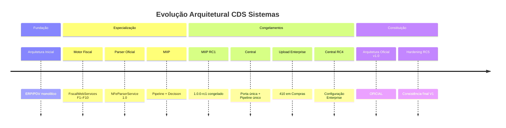

# CHANGELOG ARQUITETURAL

**Projeto:** CDS Sistemas  
**Escopo:** Somente mudanças que alteraram a arquitetura da plataforma  
**Não inclui:** bugs, hotfixes, ajustes cosméticos ou correções pontuais  

---

## Status Atual

| Campo | Valor |
|---|---|
| **Arquitetura** | **OFICIAL** |
| **Versão** | **1.0** |
| **Data de consolidação** | 2026-07-10 |
| **Congelamentos** | MIIP `1.0 RC1` · Central Inteligente `1.0 RC4` |
| **Hardening** | RC5 (2026-07-10) |
| **Constituição** | [ARQUITETURA_OFICIAL_CDS_V1.md](./ARQUITETURA_OFICIAL_CDS_V1.md) |

---

## Eventos arquiteturais

### 1. Arquitetura Inicial

| Campo | Conteúdo |
|---|---|
| **Versão** | Pré-plataforma / ERP monolítico |
| **Data** | Fundação do CDS Sistemas |
| **Resumo** | Sistema de gestão comercial (ERP/PDV) com módulos acoplados em rotas e serviços |
| **Arquitetura** | Monólito funcional — sem motores especializados nem pipeline único de entrada fiscal |
| **Motivos** | Atender operação de mercado (vendas, compras, estoque, NFC-e) |
| **Impacto** | Base operacional; dívida estrutural que motivou a plataforma de motores |
| **Documentos relacionados** | `package.json`, `electron.js`, rotas ERP/PDV |

---

### 2. Criação do Motor Fiscal

| Campo | Conteúdo |
|---|---|
| **Versão** | Plataforma Fiscal F1–F10 / RC1.1 |
| **Data** | 2026 (Sprints F1–F10 + consolidação RC1.1) |
| **Resumo** | Introdução de `FiscalWebServices`, Registry, UrlResolver, SoapTransport e runtimes por operação |
| **Arquitetura** | Camada de transporte SEFAZ desacoplada das regras de negócio; fallback legado controlado |
| **Motivos** | Unificar endpoints, TLS, retry, métricas e migração gradual sem quebrar emissão |
| **Impacto** | Autorização NFC-e, cancelamento, DF-e, status, consulta e manifestação (infra) passam pela plataforma |
| **Documentos relacionados** | [FISCAL_PLATFORM.md](./FISCAL_PLATFORM.md), `backend/services/fiscal/core/` |

---

### 3. Criação do Parser Oficial

| Campo | Conteúdo |
|---|---|
| **Versão** | Parser Oficial `1.0` |
| **Data** | Consolidação do pipeline NF-e de entrada |
| **Resumo** | `NFeParserService` / `NFeParser` como única interpretação oficial de XML de entrada |
| **Arquitetura** | Parse separado de identificação (MIIP) e de persistência comercial (`saveCompra`) |
| **Motivos** | Eliminar parsers ad hoc em Compras e fluxos paralelos de XML |
| **Impacto** | Todo XML de entrada deve usar o Parser Oficial antes de MIIP/Central |
| **Documentos relacionados** | `backend/shared/nfe/README.md`, `tests/shared/nfe/nfe-parser.test.js` |

---

### 4. Criação do MIIP

| Campo | Conteúdo |
|---|---|
| **Versão** | MIIP V1 (construção em sprints) |
| **Data** | Ciclo de implementação pré-RC1 |
| **Resumo** | Motor Inteligente de Identificação de Produtos — fachada `MiipService`, pipeline de engines, Decision/Explain/Learning |
| **Arquitetura** | Motor especializado com Orchestrator + Pipeline + 6 engines + Decision Engine único |
| **Motivos** | Centralizar identificação de produtos com score, explicabilidade e aprendizado controlado |
| **Impacto** | Compras e Central deixam de decidir vínculo de produto de forma ad hoc |
| **Documentos relacionados** | [ARQUITETURA_MIIP.md](./ARQUITETURA_MIIP.md), `backend/motores/miip/` |

---

### 5. Congelamento MIIP RC1

| Campo | Conteúdo |
|---|---|
| **Versão** | `1.0.0-rc1` |
| **Data** | 2026-07-05 |
| **Resumo** | Congelamento arquitetural do MIIP — sem novas features; documentação, health, benchmark e deprecações |
| **Arquitetura** | Pipeline oficial fixo (Canonical → Attribute → Synonyms → GTIN → Fornecedor → Similarity → Decision → Explain) |
| **Motivos** | Estabilizar contrato público antes da evolução da plataforma |
| **Impacto** | Alterações de comportamento exigem nova versão e revisão formal |
| **Documentos relacionados** | [MIIP_RC1_RELEASE_NOTES.md](./MIIP_RC1_RELEASE_NOTES.md), [MIIP_RC1_BENCHMARK.md](./MIIP_RC1_BENCHMARK.md), [MIIP_READINESS_REPORT.md](./MIIP_READINESS_REPORT.md) |

---

### 6. Criação da Central Inteligente

| Campo | Conteúdo |
|---|---|
| **Versão** | Central Inteligente (sprints iniciais → RC1) |
| **Data** | Ciclo Central de Entradas |
| **Resumo** | Caixa de entrada fiscal oficial — sync DF-e, inbox, processamento, revisão, bridge para Compras |
| **Arquitetura** | Facade → Orchestrator → Services → Repositories; porta única de documentos de entrada |
| **Motivos** | Eliminar entrada fiscal espalhada (rotas DF-e/Compras) |
| **Impacto** | Rotas legadas de upload/sync passam a HTTP 410; fluxo oficial via `/api/central-entradas` |
| **Documentos relacionados** | [CENTRAL_ENTRADAS_ARQUITETURA.md](./CENTRAL_ENTRADAS_ARQUITETURA.md), `backend/motores/central-entradas/` |

---

### 7. Pipeline Único

| Campo | Conteúdo |
|---|---|
| **Versão** | Central RC1–RC3 (consolidação) |
| **Data** | Consolidação de integridade |
| **Resumo** | Um único pipeline: SEFAZ/Upload/Chave → Central → Parser → MIIP → Revisão → Compras → `saveCompra` → ERP |
| **Arquitetura** | Proibição explícita de fluxos paralelos de entrada/identificação |
| **Motivos** | Garantir rastreabilidade, estados e reutilização |
| **Impacto** | Upload Compras e sync DF-e legado descontinuados como porta de entrada |
| **Documentos relacionados** | [ARQUITETURA_OFICIAL_CDS_V1.md](./ARQUITETURA_OFICIAL_CDS_V1.md) Cap. 6, [CENTRAL_ENTRADAS_ARQUITETURA.md](./CENTRAL_ENTRADAS_ARQUITETURA.md) |

---

### 8. Upload Enterprise

| Campo | Conteúdo |
|---|---|
| **Versão** | Upload Enterprise `1.0` (Central) |
| **Data** | Sprint de upload na Central |
| **Resumo** | `CentralUploadService` como único upload oficial de XML de entrada |
| **Arquitetura** | Upload → persistência inbox → mesmo pipeline de processamento |
| **Motivos** | Substituir upload em Compras e unificar validação/eventos |
| **Impacto** | `POST` de upload em Compras retorna **410 Gone** |
| **Documentos relacionados** | `CentralUploadService.js`, `backend/rotas/compras.js` (410) |

---

### 9. Central Configuração RC4

| Campo | Conteúdo |
|---|---|
| **Versão** | `1.0.0-rc4` |
| **Data** | 2026-07-10 |
| **Resumo** | Central de Configuração Enterprise — `CentralConfiguracaoService` como único provider operacional |
| **Arquitetura** | Tela 6 abas → Controller → Service → Repository → Sync com `contextoCentral` (sem URLs espalhadas / sem 502 genérico) |
| **Motivos** | Independência operacional da Central em relação ao Motor Fiscal para config de sync/SEFAZ/timeouts |
| **Impacto** | Diagnóstico e sync consomem contexto oficial; certificado físico permanece no cadastro fiscal via adapter |
| **Documentos relacionados** | [CENTRAL_ENTRADAS_ARQUITETURA.md](./CENTRAL_ENTRADAS_ARQUITETURA.md), `tests/central-entradas/rc4-configuracao.test.js` |

---

### 10. Arquitetura Oficial v1.0

| Campo | Conteúdo |
|---|---|
| **Versão** | Arquitetura Oficial **1.0** |
| **Data** | 2026-07-10 |
| **Resumo** | Publicação da Constituição Arquitetural do CDS Sistemas |
| **Arquitetura** | Plataforma Inteligente de Gestão Empresarial — motores, pipelines, orchestrators, contratos e regras normativas |
| **Motivos** | Encerrar a fase estrutural V1 e orientar toda evolução futura |
| **Impacto** | Nenhuma Sprint estrutural pode contrariar o documento sem revisão arquitetural formal |
| **Documentos relacionados** | [ARQUITETURA_OFICIAL_CDS_V1.md](./ARQUITETURA_OFICIAL_CDS_V1.md), este changelog, auditoria final V1 |

---

### 11. Hardening Final RC5

| Campo | Conteúdo |
|---|---|
| **Versão** | Plataforma CDS **V1** (hardening) |
| **Data** | 2026-07-10 |
| **Resumo** | Eliminação das pendências da Auditoria Final: README RC4, provider único de config, Diagnóstico via Fiscal Platform, readiness regenerado, inventário deprecated/TODO |
| **Arquitetura** | Sem novas features; consistência documental e de wiring |
| **Motivos** | Elevar V1 ao máximo de consistência antes do ciclo 2.0 |
| **Impacto** | Divergências conhecidas da auditoria eliminadas ou classificadas |
| **Documentos relacionados** | [AUDITORIA_FINAL_CDS_V1.md](./AUDITORIA_FINAL_CDS_V1.md), [RC5_HARDENING_INVENTARIO.md](./RC5_HARDENING_INVENTARIO.md), [RC5_PARECER.md](./RC5_PARECER.md) |

---

## Linha do tempo (resumo)

