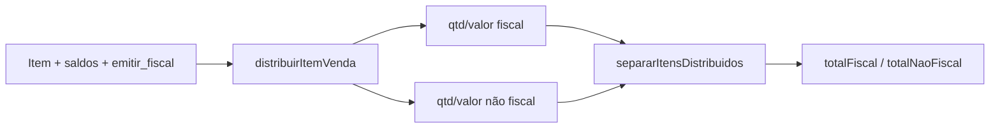
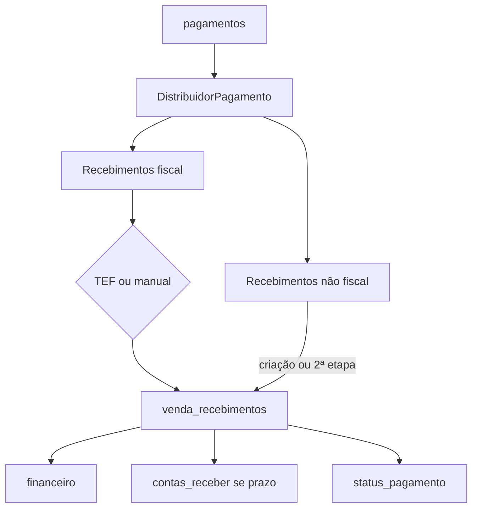
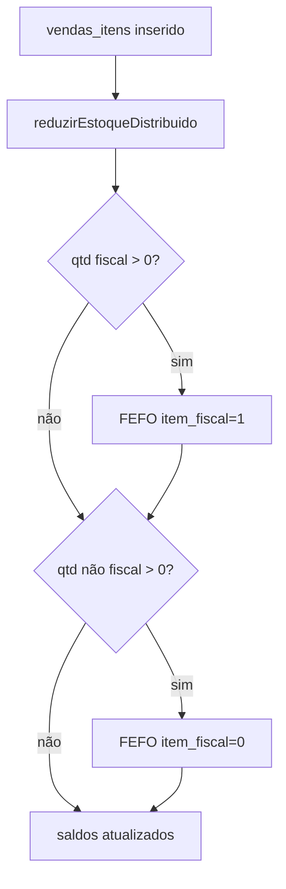
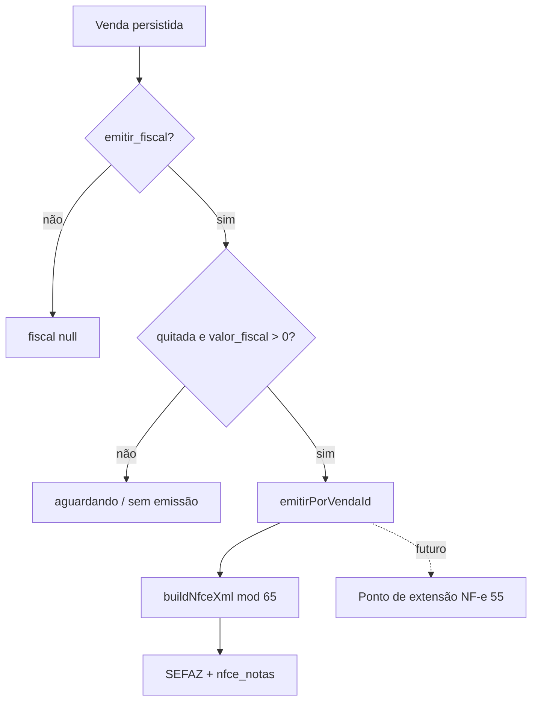
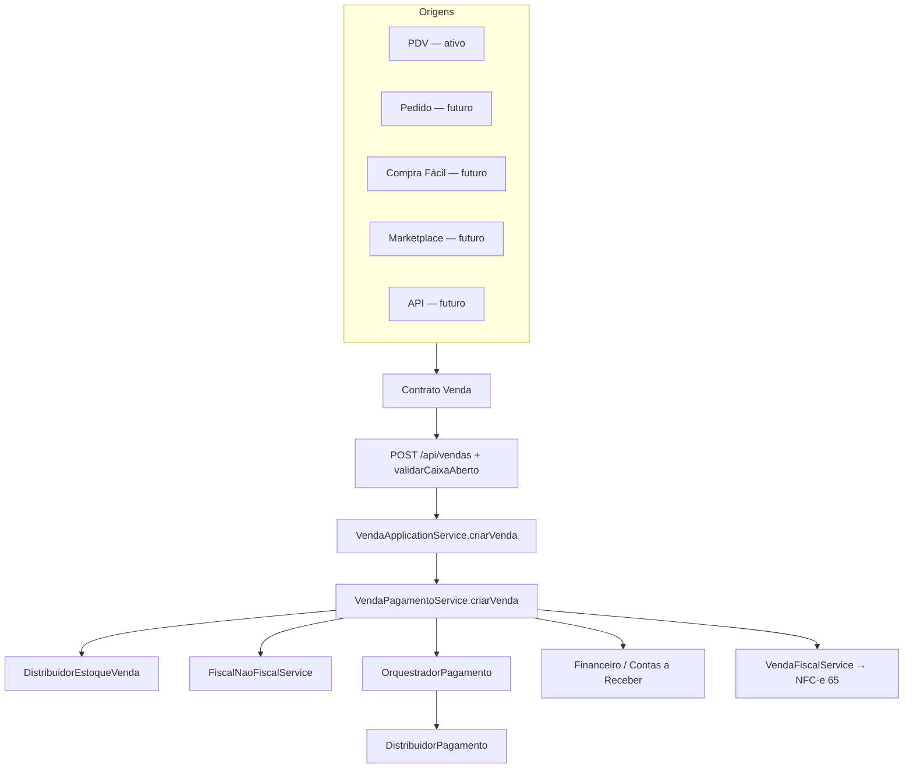

# CDS SISTEMAS V1.0

# NÚCLEO TRANSACIONAL DA VENDA — CONSOLIDAÇÃO OFICIAL (FASE 1)

| Campo | Valor |
|---|---|
| **Documento** | Núcleo Transacional da Venda |
| **Versão** | **1.1** (porta de aplicação — Sprint 2.0) |
| **Status** | **OFICIAL** |
| **Sprint** | Sprint 2.0 — Camada de Aplicação do Núcleo Transacional |
| **Data** | 2026-07-11 |
| **Tipo** | Arquitetura — fachada `VendaApplicationService` (sem alteração de regras) |
| **Constituição** | [ARQUITETURA_OFICIAL_CDS_V1.md](./ARQUITETURA_OFICIAL_CDS_V1.md) |

> **Força normativa:** Nenhuma Sprint futura de Pedidos, Faturamento (NF-e), Compra Fácil, Marketplace ou API poderá contornar este núcleo sem revisão arquitetural formal.  
> **Porta oficial:** Toda criação de venda passa por `VendaApplicationService` antes do `VendaPagamentoService`.  
> **Congelamento de regras:** Motor Fiscal × Não Fiscal, Financeiro, Estoque, TEF, PIX e NFC-e permanecem **inalterados** nesta Sprint.

---

## Índice

1. [Definição do núcleo](#1-definição-do-núcleo)
2. [Contrato oficial do objeto Venda](#2-contrato-oficial-do-objeto-venda--etapa-1)
3. [Camadas lógicas](#3-camadas-lógicas--etapa-2)
4. [Catálogo de serviços](#4-catálogo-de-serviços--etapa-3)
5. [Motor Fiscal × Não Fiscal](#5-motor-fiscal--não-fiscal--etapa-4)
6. [Fluxo financeiro](#6-fluxo-financeiro--etapa-5)
7. [Fluxo de estoque](#7-fluxo-de-estoque--etapa-6)
8. [Fluxo documental](#8-fluxo-documental--etapa-7)
9. [Acoplamentos ao PDV](#9-acoplamentos-ao-pdv--etapa-8)
10. [Preparação multi-origem](#10-preparação-para-múltiplas-origens--etapa-9)
11. [Diagrama oficial](#11-diagrama-oficial-do-núcleo--etapa-10)
12. [Relatório final da Sprint](#12-relatório-final-da-sprint)

---

## 1. Definição do núcleo

O **verdadeiro núcleo transacional** do CDS Sistemas não é o PDV. É o pipeline:

```
POST /api/vendas
  → VendaApplicationService.criarVenda
    → VendaPagamentoService.criarVenda
      → DistribuidorEstoqueVenda
      → FiscalNaoFiscalService
      → OrquestradorPagamento
        → DistribuidorPagamento
      → Financeiro (financeiro + contas_receber + venda_recebimentos)
      → VendaFiscalService
        → Documento Fiscal (NFC-e modelo 65)
```

| Papel | Quem é |
|---|---|
| **Porta de aplicação** | `VendaApplicationService.criarVenda` (fachada oficial — Sprint 2.0) |
| **Núcleo** | `VendaPagamentoService.criarVenda` operando sobre o agregado **Venda** |
| **Cliente atual** | PDV (`frontend/pdv/js/pdv.js`) |
| **Porta HTTP** | `backend/rotas/vendas.js` + `validarCaixaAberto` |
| **Documento atual** | NFC-e (modelo **65**) via `fiscal/emissor.js` |

---

## 2. Contrato oficial do objeto Venda — Etapa 1

### 2.1 Contrato de entrada HTTP (`POST /api/vendas`)

Fonte: `VendaPagamentoService.criarVenda` + payload montado em `frontend/pdv/js/pdv.js`.

#### Campos obrigatórios

| Campo | Tipo | Regra |
|---|---|---|
| `itens` | `array` | Não vazio; cada item exige `produto_id` |
| `itens[].produto_id` | `number` | Produto existente |
| `itens[].quantidade` | `number` | Quantidade comercial |
| `itens[].preco_unitario` | `number` | Preço unitário |
| `itens[].subtotal` | `number` | Subtotal do item |
| `total` | `number` | `> 0`, não NaN |
| `forma_pagamento` | `string` | Ex.: `dinheiro`, `pix`, `cartao_debito`, `cartao_credito`, `prazo`, `credito`, `misto` |

#### Campos opcionais

| Campo | Tipo | Uso |
|---|---|---|
| `cliente_id` | `number\|null` | Obrigatório se `prazo` ou `credito` |
| `desconto` | `number` | Desconto da venda |
| `pagamentos` | `array` | Lista de formas/valores; se length > 1 → `forma_pagamento = "misto"` |
| `emitir_fiscal` | `boolean\|string\|1` | Solicita NFC-e |
| `cpf_cnpj_nota` | `string` | CPF/CNPJ do consumidor (11 ou 14 dígitos) |
| `valor_recebido` | `number` | Dinheiro |
| `parcelas` | `number` | Venda a prazo |
| `primeiro_vencimento` | `string (YYYY-MM-DD)` | Venda a prazo |
| `forcar` | `boolean` | Bypass aviso de débitos (prazo) |
| `tef` | `object` | Vínculo TEF da venda |
| `valor_fiscal` | `number` | Auxilia validação de soma (PDV pré-calcula) |
| `valor_nao_fiscal` | `number` | Auxilia validação de soma (PDV pré-calcula) |
| `supervisor_token` | `string` | Autorização de desconto (PDV) |

#### Campos do item (opcionais / comerciais)

| Campo | Tipo | Uso |
|---|---|---|
| `desconto_percentual` | `number` | Desconto do item |
| `promocao_id` | `number\|null` | Promoção |
| `desconto_atacado` | `number` | Atacado |
| `tipo_preco` | `string` | Default `varejo` |
| `item_fiscal` | `0\|1` | Hint; distribuição real é recalculada no backend |
| `tipo_venda` | `string` | `PESO` / unidade |
| `quantidade_estoque` | `number` | Conversão unidade→estoque (fracionado) |

#### Campos do pagamento (`pagamentos[]`)

| Campo | Tipo | Uso |
|---|---|---|
| `forma_pagamento` | `string` | Forma |
| `valor` | `number` | Valor |
| `tipo_recebimento` | `fiscal\|nao_fiscal` | Opcional; usado em validação mista |
| `tef_transacao_id` / `tef.*` | vários | NSU, autorização, bandeira, comprovantes |

#### Campos calculados pelo núcleo (não enviados como verdade — gerados no backend)

| Campo | Origem |
|---|---|
| `codigo` | `VND-{timestamp local}` |
| `data_venda` | data local Brasil |
| `quantidade_fiscal` / `quantidade_nao_fiscal` | `distribuirItemVenda` |
| `valor_fiscal` / `valor_nao_fiscal` (item e venda) | distribuição + `separarItensDistribuidos` |
| `status` | `'concluida'` na criação |
| `status_pagamento` | Orquestrador + regras de status |
| `caixa_sessao_id`, `caixa_id`, `terminal_id`, `operador_id` | middleware de caixa / token |

### 2.2 Classificação por domínio

| Domínio | Campos |
|---|---|
| **Comerciais** | `itens`, `total`, `desconto`, `cliente_id`, `forma_pagamento`, promoções, `tipo_preco`, `tipo_venda` |
| **Fiscais** | `emitir_fiscal`, `cpf_cnpj_nota`, `quantidade_fiscal`, `valor_fiscal`, `item_fiscal` |
| **Não fiscais** | `quantidade_nao_fiscal`, `valor_nao_fiscal` |
| **Financeiros** | `pagamentos`, `valor_recebido`, `parcelas`, `primeiro_vencimento`, `status_pagamento`, `tef` |
| **Operacionais / caixa** | `caixa_sessao_id`, `caixa_id`, `terminal_id`, `operador_id` |

### 2.3 Persistência (agregado Venda)

**Tabela `vendas`:** `id`, `codigo`, `data_venda`, `cliente_id`, `total`, `desconto`, `forma_pagamento`, `status`, `valor_recebido`, `caixa_id`, `caixa_sessao_id`, `terminal_id`, `operador_id`, `cpf_cnpj_nota`, `valor_fiscal`, `valor_nao_fiscal`, `status_pagamento`, `tef_transacao_id`, cancelamento, auditoria de desconto, `created_at`.

**Tabela `vendas_itens`:** vínculo produto, quantidades/valores F×NF, descontos, `tipo_venda`.

**Tabelas satélite:** `venda_pagamentos`, `venda_recebimentos`, `financeiro`, `contas_receber`, `nfce_notas`, `tef_transacoes`.

> **Ausência oficial V1.0:** não existe campo `origem` / `canal` / `tipo_documento` na venda. A origem atual é implícita (quem chama `POST /api/vendas`).

### 2.4 Contrato mínimo para iniciar o pipeline

Qualquer origem futura (Pedido, Compra Fácil, API, Marketplace) deverá produzir **no mínimo**:

```json
{
  "itens": [
    {
      "produto_id": 1,
      "quantidade": 1,
      "preco_unitario": 10.0,
      "subtotal": 10.0
    }
  ],
  "total": 10.0,
  "forma_pagamento": "pix",
  "pagamentos": [
    { "forma_pagamento": "pix", "valor": 10.0 }
  ],
  "emitir_fiscal": false
}
```

Mais: contexto de autenticação e, **hoje**, caixa aberto (`validarCaixaAberto`).

---

## 3. Camadas lógicas — Etapa 2

> **NÃO houve movimentação de código.** Separação apenas documental.

| Camada | Responsabilidade | Arquivos (código existente) |
|---|---|---|
| **HTTP** | Rotas REST, status codes, binding `req`/`res` | `backend/rotas/vendas.js` · `backend/server.js` (`/api/vendas`) |
| **Middleware** | Auth, licença, **caixa aberto** | `verificarToken` · `licencaMiddleware` · `validarCaixaAberto` |
| **Aplicação (porta oficial)** | Fachada de entrada do núcleo — **sem regras** | `VendaApplicationService` |
| **Domínio (núcleo)** | Regras de venda, F×NF, pagamento, estoque, financeiro, status | `VendaPagamentoService` · `distribuidorEstoqueVenda` · `fiscalNaoFiscalService` · `OrquestradorPagamento` · `DistribuidorPagamento` · `VendaFinanceiroService` · `VendaFiscalService` |
| **Infraestrutura** | SQLite, TEF, SEFAZ, lotes FEFO, config | `database.js` · `tef/*` · `fiscal/emissor.js` · `fiscal/xmlBuilder.js` · `lotesService` · `configuracaoService` |
| **Apresentação PDV** | Coleta UI, pré-cálculo, TEF client-side, cupom | `frontend/pdv/js/pdv.js` e afins |

**Observação (Sprint 2.0):** `VendaApplicationService` é a **única porta oficial** de criação de venda. O núcleo (`VendaPagamentoService`) permanece responsável por toda a lógica.

---

## 4. Catálogo de serviços — Etapa 3

### 4.0 `VendaApplicationService` (porta oficial — Sprint 2.0)

| Item | Conteúdo |
|---|---|
| **Arquivo** | `backend/services/vendas/VendaApplicationService.js` |
| **Responsabilidade** | Fachada de aplicação — coordenar entrada ao núcleo **sem regras** |
| **Entrada** | `req`/`res` HTTP (inalterados) |
| **Saída** | Idem `VendaPagamentoService.criarVenda` (delegação integral) |
| **Quem chama** | `rotas/vendas.js` (`POST /`) |
| **Quem é chamado** | `VendaPagamentoService.criarVenda` apenas |

### 4.1 `VendaPagamentoService`

| Item | Conteúdo |
|---|---|
| **Arquivo** | `backend/services/vendas/VendaPagamentoService.js` |
| **Responsabilidade** | Orquestrar criação da venda, baixa de estoque, recebimentos, financeiro e disparo fiscal |
| **Entrada** | `req`/`res` HTTP (body da Venda + contexto de caixa) |
| **Saída** | JSON da venda + `fiscal` opcional |
| **Quem chama** | `VendaApplicationService.criarVenda` (criação); `rotas/vendas.js` (pré-cálculo, pagamento não fiscal) |
| **Quem é chamado** | DistribuidorEstoque, FiscalNaoFiscal, Orquestrador, lotes, TEF config, VendaFiscal, VendaFinanceiro |

### 4.2 `distribuidorEstoqueVenda`

| Item | Conteúdo |
|---|---|
| **Arquivo** | `backend/services/distribuidorEstoqueVenda.js` |
| **Responsabilidade** | Distribuir quantidade/valor entre fiscal e não fiscal conforme flag e saldos |
| **Entrada** | item, `saldoFiscal`, `saldoNaoFiscal`, `vendaFiscal` |
| **Saída** | `{ sucesso, quantidadeFiscal, quantidadeNaoFiscal, valorFiscal, valorNaoFiscal }` |
| **Quem chama** | `criarVenda`, `preCalcularDistribuicao` |
| **Quem é chamado** | (puro — sem I/O) |

### 4.3 `fiscalNaoFiscalService`

| Item | Conteúdo |
|---|---|
| **Arquivo** | `backend/services/fiscalNaoFiscalService.js` |
| **Responsabilidade** | Separar/somar totais fiscal e não fiscal de itens já distribuídos |
| **Entrada** | lista de itens |
| **Saída** | `{ totalFiscal, totalNaoFiscal }` (e variantes por `item_fiscal`) |
| **Quem chama** | `VendaPagamentoService` |
| **Quem é chamado** | (puro) |

### 4.4 `OrquestradorPagamento`

| Item | Conteúdo |
|---|---|
| **Arquivo** | `backend/services/OrquestradorPagamento.js` |
| **Responsabilidade** | Único ponto de decisão do fluxo de pagamento da venda |
| **Entrada** | `totalFiscal`, `totalNaoFiscal`, `formaPagamento`, `pagamentos`, flags TEF/modo |
| **Saída** | `{ sucesso, statusPagamento, recebimentos, distribuicao, resultadoFiscal, proximaAcao }` |
| **Quem chama** | `criarVenda` (vista e prazo) |
| **Quem é chamado** | `DistribuidorPagamento`, TEF (`TefManager`, `tefFluxoPagamento`, `tefConfigService`) |

### 4.5 `DistribuidorPagamento`

| Item | Conteúdo |
|---|---|
| **Arquivo** | `backend/services/DistribuidorPagamento.js` |
| **Responsabilidade** | Alocar valores de pagamento ao fiscal e depois ao não fiscal por prioridade de forma |
| **Entrada** | `pagamentos[]`, `totalFiscal`, `totalNaoFiscal` |
| **Saída** | `recebimentosFiscal`, `recebimentosNaoFiscal`, saldos remanescentes |
| **Prioridade** | pix → cartao_debito → cartao_credito → cartao → dinheiro |
| **Quem chama** | `OrquestradorPagamento` |

### 4.6 `VendaFinanceiroService`

| Item | Conteúdo |
|---|---|
| **Arquivo** | `backend/services/vendas/VendaFinanceiroService.js` |
| **Responsabilidade** | Helpers financeiros (data local, validação de soma de pagamentos, exclusões de canceladas) |
| **Quem chama** | `VendaPagamentoService`, rotas de vendas/financeiro |

### 4.7 `VendaFiscalService`

| Item | Conteúdo |
|---|---|
| **Arquivo** | `backend/services/vendas/VendaFiscalService.js` |
| **Responsabilidade** | Gate de emissão pós-venda; cancelamento NFC-e; vínculo TEF↔NFC-e |
| **Entrada** | `vendaId`, flag emitir, status pagamento, valores F/NF |
| **Saída** | payload `fiscal` na resposta HTTP |
| **Quem chama** | `criarVenda`, `registrarPagamentoNaoFiscal` |
| **Quem é chamado** | `fiscal/emissor.emitirPorVendaId`, `cancelarNfce`, TEF |

### 4.8 `fiscal/emissor`

| Item | Conteúdo |
|---|---|
| **Arquivo** | `backend/services/fiscal/emissor.js` |
| **Responsabilidade** | Emitir NFC-e a partir da venda persistida |
| **Entrada** | `vendaId` |
| **Saída** | sucesso/status/número/chave/DANFE |
| **Quem é chamado** | `xmlBuilder.buildNfceXml` (modelo **65**), assinatura, SEFAZ, `nfce_notas` |

### 4.9 `lotesService` (FEFO)

| Item | Conteúdo |
|---|---|
| **Arquivo** | `backend/services/lotesService.js` |
| **Responsabilidade** | Consumo FEFO quando produto controla validade |
| **Quem chama** | `reduzirEstoqueComFEFO` em `VendaPagamentoService` |

### 4.10 Serviços satélite da venda

| Serviço | Arquivo | Papel |
|---|---|---|
| Cancelamento | `VendaCancelamentoService.js` | Cancelar venda / NFC-e |
| Devolução | `VendaDevolucaoService.js` | Devolução parcial |
| TEF | `backend/services/tef/*` | Autorização/cancelamento fiscal |
| Config | `configuracaoService.js` | Modo confirmação fiscal |

---

## 5. Motor Fiscal × Não Fiscal — Etapa 4

### 5.1 Mapa de responsabilidades

| Pergunta | Resposta (código atual) |
|---|---|
| **Quem inicia** | `criarVenda` / `preCalcularDistribuicao` com flag `emitir_fiscal` → `parseVendaFiscalFlag` |
| **Quem calcula valores fiscais / não fiscais** | `distribuirItemVenda` (por item) + `separarItensDistribuidos` (totais) |
| **Quem consome** | Orquestrador (pagamentos), persistência de itens, emissor (só fatia fiscal) |
| **Quem grava** | `INSERT vendas` / `vendas_itens` com colunas F×NF |
| **Quem altera estoque** | `reduzirEstoqueDistribuido` (após insert do item) |
| **Quem altera financeiro** | **Não** o motor F×NF de estoque — o financeiro é o Orquestrador + INSERTs em `criarVenda` |
| **Quem distribui pagamentos** | `DistribuidorPagamento` (motor financeiro F×NF), **não** o distribuidor de estoque |
| **Onde termina** | Após quantidades/valores F×NF definidos e totais calculados; a partir daí pagamentos, estoque físico e NFC-e são etapas seguintes |

### 5.2 Regra de prioridade (congelada)

- `emitir_fiscal = true` → consome **saldo fiscal primeiro**
- `emitir_fiscal = false` → consome **saldo não fiscal primeiro**
- Quantidade > estoque total → rejeição

### 5.3 Fluxograma



---

## 6. Fluxo financeiro — Etapa 5

### 6.1 Distribuição dos pagamentos

1. Normalizar `pagamentos` / forma única (`OrquestradorPagamento`).
2. `distribuirPagamentos` — prioridade de forma; aloca **primeiro ao fiscal**, resto ao não fiscal.
3. Validar `saldoFiscal === 0` (pagamento fiscal insuficiente → erro).

### 6.2 Recebimentos fiscais

- Processados em `processarRecebimentoFiscal`:
  - TEF se habilitado e forma exige TEF e modo ≠ MANUAL
  - Senão confirmação manual
- Gravados em `venda_recebimentos` com `tipo_recebimento = 'fiscal'`

### 6.3 Recebimentos não fiscais

- Venda **somente NF** ou NF já coberto: pode gravar na criação
- Venda **mista** (fiscal + não fiscal): status `aguardando_nao_fiscal`; 2ª etapa em `POST /api/vendas/:id/pagamento-nao-fiscal`
- TEF **proibido** no não fiscal (`validarPagamentosNaoFiscal`)

### 6.4 Parcelamentos / contas a receber

- Forma `prazo`: `contas_receber` por parcela + linhas `financeiro` pendentes
- Crédito / regras de cliente: limite e `credito_atual`

### 6.5 Livro financeiro

- `INSERT INTO financeiro` com `origem = 'venda'`, `referencia_tipo = 'venda'`, `categoria = 'vendas'`
- Vista: status `recebido` (baixado) ou `pendente` conforme forma
- Prazo: uma linha por parcela, status `pendente`

### 6.6 Fluxograma



---

## 7. Fluxo de estoque — Etapa 6

| Etapa | Componente |
|---|---|
| Distribuição fiscal / não fiscal | `distribuirItemVenda` |
| Persistência da intenção | colunas em `vendas_itens` |
| Baixa | `reduzirEstoqueDistribuido` |
| FEFO | `lotesService.consumirLotesFEFO` + `registrarConsumoVenda` se controla validade |
| Saldos | `UPDATE produtos.saldo_fiscal` e/ou `saldo_nao_fiscal` e `estoque_atual` |



---

## 8. Fluxo documental — Etapa 7

| Pergunta | Resposta |
|---|---|
| **Onde nasce** | Após COMMIT da venda, em `responderVendaComFiscal` / `emitirFiscalSeSolicitado` |
| **Onde se escolhe o modelo** | **Fixo no código:** `buildNfceXml` → `<mod>65</mod>` (`xmlBuilder.js`) |
| **Onde ocorre emissão** | `emitirPorVendaId` (`emissor.js`) → assinatura → SEFAZ |
| **Onde persiste** | `nfce_notas` |
| **Onde poderá existir Modelo 55** | Futuro ponto de extensão **após** o gate de `VendaFiscalService` / ao lado de `emitirPorVendaId` — **não implementar nesta Sprint** |

Condições atuais de emissão:

1. `emitir_fiscal` explícito  
2. `valor_fiscal > 0`  
3. `status_pagamento === 'quitada'`  
4. Itens com `quantidade_fiscal > 0` e `valor_fiscal > 0`

**NF-e 55** existente no repositório refere-se a **devolução de compra**, não a faturamento de venda.



---

## 9. Acoplamentos ao PDV — Etapa 8

### 9.1 Somente PDV / operação de caixa

| Ponto | Arquivo / local |
|---|---|
| UI de venda, carrinho, modais F×NF | `frontend/pdv/js/pdv.js` |
| Único `POST /api/vendas` de criação | `pdv.js` |
| Pré-cálculo client-side | `POST .../pre-calcular-distribuicao` chamado pelo PDV |
| Cupom não fiscal / impressão PDV | `frontend/pdv/*`, `frontend/shared/js/*` |
| Heartbeat de terminal `origem=pdv` | `backend/rotas/terminais.js` |
| Sessão de caixa obrigatória na criação | `validarCaixaAberto` |

### 9.2 Pertencem ao núcleo (independentes da UI PDV)

- `distribuidorEstoqueVenda`
- `fiscalNaoFiscalService`
- `OrquestradorPagamento` / `DistribuidorPagamento`
- Persistência estoque/financeiro/recebimentos em `VendaPagamentoService`
- `VendaFiscalService` + emissor NFC-e
- Cancelamento / devolução sobre venda já criada

### 9.3 Resposta objetiva

| Dependência | Classificação |
|---|---|
| Caixa aberto na criação | **Acoplamento de porta** (hoje PDV) — não é regra F×NF |
| Terminal / operador / sessão | **Operacional PDV/multi-caixa** |
| Heartbeat / cupom / frontend | **Exclusivo PDV** |
| Motores F×NF, pagamentos, estoque, NFC-e | **Núcleo** |

---

## 10. Preparação para múltiplas origens — Etapa 9

Pergunta: se a origem gerar **exatamente o mesmo objeto Venda** e chamar o mesmo pipeline…

| Origem | Funciona hoje? | Motivo |
|---|---|---|
| **Pedido** | **Condicional** | Payload sim; **exige caixa aberto** + auth; Pedido não existe |
| **Compra Fácil** | **Condicional** | Idem |
| **API** | **Condicional** | Endpoint já é API; mesmo gate de caixa |
| **Marketplace** | **Condicional** | Idem |
| **PDV** | **Sim** | Cliente oficial atual |

### Adaptações futuras necessárias (NÃO implementar agora)

1. **Porta sem caixa obrigatório** (ou sessão sintética) para origens não presenciais.  
2. Extrair **serviço de domínio** puro a partir de `criarVenda` (sem mudar regras).  
3. Campo **`origem` / `canal`** na venda (rastreabilidade).  
4. Conversor **Pedido → Venda** (módulo futuro).  
5. **Abstração documental** NFC-e 65 / NF-e 55 no gate fiscal (Faturamento).  
6. Política TEF/PIX por origem (presencial vs remoto), sem alterar regras do motor atual do PDV.

---

## 11. Diagrama oficial do núcleo — Etapa 10

Arquitetura refletindo o código existente + origens futuras documentadas:



Versão textual oficial:

```
Origem (PDV)
│
Controller (POST /api/vendas + caixa aberto)
│
VendaApplicationService
│
VendaPagamentoService
│
Motor Fiscal × Não Fiscal
│
Financeiro
│
Estoque
│
Documento Fiscal (NFC-e 65)
```

---

## 12. Relatório final da Sprint

### 1. Contrato oficial do objeto Venda

Documentado na [Seção 2](#2-contrato-oficial-do-objeto-venda--etapa-1).

### 2. Fluxograma completo do núcleo

Documentado nas seções 1, 5–8 e 11.

### 3. Serviços reutilizáveis (núcleo)

- `distribuidorEstoqueVenda.js`
- `fiscalNaoFiscalService.js`
- `DistribuidorPagamento.js`
- `OrquestradorPagamento.js`
- Núcleo de `VendaPagamentoService.js` (persistência / estoque / financeiro)
- `VendaFinanceiroService.js`
- `VendaFiscalService.js` + `fiscal/emissor.js` (NFC-e)
- `lotesService.js`
- `VendaCancelamentoService.js` / `VendaDevolucaoService.js` (pós-venda)

### 4. Serviços / artefatos exclusivos do PDV

- `frontend/pdv/**`
- Heartbeat `origem=pdv` em terminais
- UX de cupom / modais de pagamento não fiscal / TEF no cliente
- Uso exclusivo atual de `POST /api/vendas` para criação

### 5. Pontos de acoplamento

- `validarCaixaAberto` na criação
- Colunas `caixa_sessao_id`, `terminal_id`, `operador_id`
- Handler HTTP acoplado ao domínio em `criarVenda`
- Documento fixo modelo 65
- Ausência de campo `origem`

### 6. Futuras adaptações (Pedido, Faturamento NF-e, Compra Fácil, API)

Listadas na [Seção 10](#10-preparação-para-múltiplas-origens--etapa-9).

### 7. Confirmação — Motor Fiscal × Não Fiscal

**Confirmado:** nenhuma regra do Motor Fiscal × Não Fiscal foi alterada nesta Sprint. Apenas documentação.

### 8. Confirmação — regressão

**Confirmado:** nenhum arquivo de runtime (rotas, serviços, frontend, banco, payload, endpoints) foi modificado. Nenhuma regressão funcional foi introduzida.

### 9. Confirmação — comportamento do núcleo

**Confirmado:** o núcleo transacional permanece funcionando **exatamente como antes**. Esta Sprint consolida e oficializa a arquitetura descoberta na auditoria, sem mudança de comportamento.

---

## Histórico

| Data | Evento |
|---|---|
| 2026-07-11 | Publicação oficial V1.0 — Sprint 1 Fase 1 (somente documentação) |

## Referências de código

- `backend/rotas/vendas.js`
- `backend/services/vendas/VendaPagamentoService.js`
- `backend/services/distribuidorEstoqueVenda.js`
- `backend/services/fiscalNaoFiscalService.js`
- `backend/services/OrquestradorPagamento.js`
- `backend/services/DistribuidorPagamento.js`
- `backend/services/vendas/VendaFiscalService.js`
- `backend/services/vendas/VendaFinanceiroService.js`
- `backend/services/fiscal/emissor.js`
- `backend/services/fiscal/xmlBuilder.js`
- `backend/middleware/validarCaixaAberto.js`
- `frontend/pdv/js/pdv.js`
- `ARQUITETURA_PAGAMENTOS.md` (raiz)
