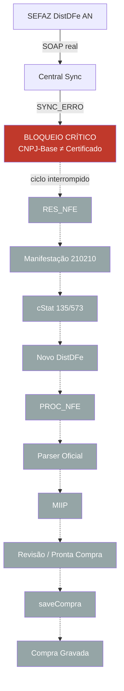

# RC7.0 — Homologação Operacional Oficial da Central Inteligente

**Versão:** CDS Sistemas V1.0  
**Data da auditoria:** 2026-07-18  
**Ambiente inspecionado:** `C:\ProgramData\MercantilFiscal\dados\mercadao.db`  
**Modo:** somente leitura — **nenhuma linha de código, banco ou API foi alterada**.

---

## Parecer executivo (1 frase)

**A Central Inteligente NÃO está homologada para produção contínua:** a sincronização DistDFe real falhou por divergência CNPJ × certificado, o ambiente fiscal configurado é **homologação (2)** (não produção), e o ciclo completo RES→Manifestação→PROC→Parser→MIIP→Compra **não foi executado ponta a ponta com SEFAZ real**.

---

## 1. Fluxograma final (estado observado)



Legenda: nós cinza = **não executados em SEFAZ real nesta homologação**.  
Nós vermelhos = **falha observada**.

---

## 2. Pré-condições do escopo RC7.0

| Requisito RC7.0 | Evidência | Status |
|-----------------|-----------|--------|
| Certificado A1 real | Path configurado em `fiscal_certificado_path` | Presente |
| **Produção SEFAZ** | `fiscal_ambiente = **2**` (homologação) | **FALHOU** |
| Comunicação SOAP real | Sync 22:38 e 22:39 retornaram rejeição SEFAZ | Parcial (SOAP chegou; negócio rejeitou) |
| CNPJ configurado | `cnpj = 36.811.652/0001-53` / NSU `36811652000153` | Presente |
| Central Inteligente oficial | Eventos / services ativos | Presente |
| RC6.9 Manifestação → AN | Registry resolve `www.nfe.fazenda.gov.br` / `hom1...` | Código alinhado (sem prova operacional 135/573) |

---

## 3. Comunicação SOAP — evidências reais

### 3.1 Contrato oficial resolvido (Plataforma Fiscal / Registry)

| Serviço | Ambiente config. | Endpoint | Host | SOAPAction |
|---------|------------------|----------|------|------------|
| DistDFe | Homologação (2) | `https://hom1.nfe.fazenda.gov.br/NFeDistribuicaoDFe/NFeDistribuicaoDFe.asmx` | `hom1.nfe.fazenda.gov.br` | `.../NFeDistribuicaoDFe/nfeDistDFeInteresse` |
| Manifestação 210210 | Homologação | `https://hom1.nfe.fazenda.gov.br/NFeRecepcaoEvento4/NFeRecepcaoEvento4.asmx` | `hom1.nfe.fazenda.gov.br` | `.../NFeRecepcaoEvento4/nfeRecepcaoEvento` |
| Manifestação 210210 | Produção (registry) | `https://www.nfe.fazenda.gov.br/NFeRecepcaoEvento4/NFeRecepcaoEvento4.asmx` | `www.nfe.fazenda.gov.br` | idem |

### 3.2 Tentativas reais de sync (hoje)

| # | CorrelationId | Tempo | Resultado | cStat | xMotivo / descrição |
|---|---------------|-------|-----------|-------|---------------------|
| 1 | `d8476b60-47a9-4890-bbbf-b537a8dd301c` | **728 ms** | SYNC_ERRO | `null` | Rejeição: CNPJ-Base consultado difere do CNPJ-Base do Certificado Digital |
| 2 | `75bea982-679f-408b-96ec-d10ffeb16d43` | **599 ms** | SYNC_ERRO | `null` | Idem |

- **HTTP / RequestId:** não persistidos no `detalhe_json` destes eventos (apenas `correlationId`).  
- **Telemetria RC6.6 em memória:** não capturada nesta sessão (processo de auditoria separado do servidor em execução).  
- **NSU após falha:** `ult_nsu=000000000000000`, `max_nsu=000000000000000`, `ultimo_cstat` vazio.

---

## 4. Manifestação (210210)

| Métrica | Valor |
|---------|-------|
| Eventos `MANIFESTACAO_*` / `CIENCIA_*` no banco | **0** |
| Evento enviado | Não |
| Evento aceito (135/573) | Não |
| Evento rejeitado (ex.: 215) | Não observado nesta base |
| Quantidade | 0 |
| Tempo | N/A |
| Política configurada | `MANUAL` |

**Conclusão:** Manifestação operacional **não validada** em SEFAZ real.

---

## 5. Distribuição DF-e

| Métrica | Valor |
|---------|-------|
| RES_NFE recebidos (SEFAZ real) | **0** |
| PROC_NFE recebidos (SEFAZ real) | **0** |
| Tempo médio DistDFe | N/A (falhou antes de cStat útil) |
| Tempo máximo tentativa | **728 ms** (até rejeição CNPJ) |
| Atualização do mesmo documento | Não aplicável |
| Duplicidade | 0 notas novas / 0 duplicadas nos SYNC_ERRO |
| Documentos na Central | **0** |

---

## 6. Parser Oficial

| Métrica | Valor | Observação |
|---------|-------|------------|
| Quantidade processada | 5 (`PARSER_CONCLUIDO`) | Origem **testes automatizados** (~22:31), não ciclo SEFAZ |
| Falhas | 0 nos eventos de teste | — |
| Tempo médio | ~1–11 ms | Amostra de teste |

**Conclusão:** Parser funcional em laboratório; **não homologado no ciclo real**.

---

## 7. MIIP

| Métrica | Valor | Observação |
|---------|-------|------------|
| Quantidade | 5 (`MIIP_CONCLUIDO`) | Testes |
| Automáticas / Revisão | Documentos de teste → `AGUARDANDO_REVISAO` | Pendências MIIP |
| Precisão | Não mensurável em produção | Sem amostra SEFAZ |
| Tempo médio | ~15–32 ms | Testes |

**Conclusão:** MIIP operacional em laboratório; **não homologado no ciclo real**.

---

## 8. Compras

| Métrica | Valor | Observação |
|---------|-------|------------|
| Quantidade gerada | 1 (`COMPRA_GRAVADA`) | Teste sprint 8 |
| Duplicidades | Não evidenciadas | — |
| Falhas | 0 no evento de teste | — |
| Tempo médio | N/A | — |

**Conclusão:** Bridge Compras existe; **fluxo real Pós-PROC não validado**.

---

## 9. Telemetria RC6.6

| Campo | Status na evidência operacional |
|-------|----------------------------------|
| CorrelationId | **Presente** nos SYNC reais |
| RequestId | Não persistido nos eventos de sync inspecionados |
| HTTP | Não persistido no `detalhe_json` do SYNC_ERRO |
| SOAP tempo | Duracao evento ≈ **599–728 ms** |
| Persistência | Eventos Central gravados; soap audit compactado não encontrado nesta auditoria |
| Eventos | `SYNC_INICIADA` / `SYNC_ERRO` |

---

## 10. Histórico / Timeline / Heatmap

### Timeline real (trechos relevantes)

| Hora (local DB) | Evento | Evidência |
|-----------------|--------|-----------|
| 22:31:22–27 | DOCUMENTO_*, PARSER, MIIP, COMPRA | **Testes automatizados** |
| 22:38:25–26 | SYNC_INICIADA → SYNC_ERRO | **SOAP real** — CNPJ ≠ Cert |
| 22:39:17 | SYNC_INICIADA → SYNC_ERRO | **SOAP real** — idem |

### Heatmap (ciclo oficial)

| Etapa | Executada (SEFAZ real)? | Saúde |
|-------|-------------------------|-------|
| DistDFe | Tentada | 🔴 Bloqueada |
| RES_NFE | Não | ⬜ |
| Manifestação 210210 | Não | ⬜ |
| PROC_NFE | Não | ⬜ |
| Parser | Só teste | 🟡 Lab only |
| MIIP | Só teste | 🟡 Lab only |
| Revisão → Compra | Só teste | 🟡 Lab only |
| Compra Gravada | Só teste | 🟡 Lab only |

### Estados / banco

| Verificação | Resultado |
|-------------|-----------|
| Documentos duplicados | 0 documentos |
| Compras duplicadas | 1 compra (teste); sem evidência de duplicidade |
| Estados inválidos | Nenhum documento ativo para auditar |
| Transições mortas | Ciclo SEFAZ não avançou além do sync |

---

## 11. Tempo médio ponta a ponta (SEFAZ → Compra)

| Trecho | Tempo |
|--------|-------|
| SEFAZ → Central (sync falho) | ~0,6–0,7 s até rejeição |
| Central → Parser → MIIP → Compras (ciclo real) | **Não medido** — ciclo não completou |

---

## 12. Classificação por domínio

| Domínio | Nota | Comentário |
|---------|------|------------|
| Arquitetura | 🟢 Adequada | Camadas preservadas (RC6.x) |
| Comunicação | 🔴 Bloqueada | CNPJ × certificado |
| Registry | 🟢 OK (código) | AN DistDFe + Manifestação (RC6.9) |
| UrlResolver | 🟢 OK (código) | Força AN em Manifestação |
| SOAP | 🟡 Parcial | Transporte responde; rejeição de negócio |
| Manifestação | 🔴 Não validada | 0 eventos |
| Parser | 🟡 Lab only | |
| MIIP | 🟡 Lab only | |
| Central | 🟡 Operacional parcial | UI/eventos OK; ciclo SEFAZ parado |
| Compras | 🟡 Lab only | |
| Telemetria | 🟡 Parcial | CorrelationId ok; HTTP/RequestId incompletos no evento |
| Performance | ⬜ N/A ciclo completo | |
| Observabilidade | 🟡 Parcial | |

---

## 13. Parecer final (perguntas obrigatórias)

| # | Pergunta | Resposta |
|---|----------|----------|
| 1 | A Central Inteligente está homologada para produção contínua? | **NÃO** |
| 2 | Existe algum bloqueador crítico? | **SIM** — CNPJ-Base consultado ≠ CNPJ-Base do certificado (DistDFe impossível) |
| 3 | Existe algum bloqueador alto? | **SIM** — `fiscal_ambiente=2` (homologação), fora do requisito “Produção SEFAZ”; ciclo Manifestação→PROC nunca executado |
| 4 | Existe algum risco operacional? | **SIM** — política Manifestação `MANUAL`; NSU zerado; ausência de prova 135/573 pós-RC6.9 |
| 5 | O fluxo completo foi executado com sucesso? | **NÃO** |
| 6 | A Plataforma Fiscal pode ser considerada oficialmente homologada? | **NÃO** (código alinhado; operação real não comprovada) |
| 7 | A Central Inteligente pode ser congelada como versão oficial 1.0? | **NÃO** — congelamento 1.0 exige ciclo SEFAZ real completo |

---

## 14. Bloqueadores registrados (sem correção — escopo RC7.0)

### Crítico
1. **CNPJ consultado ≠ CNPJ do certificado digital** — SYNC_ERRO real (corr `d8476b60-...`, `75bea982-...`).

### Alto
2. Ambiente fiscal **não é produção** (`fiscal_ambiente=2`).  
3. Ciclo DF-e completo **ausente** (0 RES/PROC reais, 0 manifestações).

### Risco
4. Homologação RC6.9 (AN) **sem cStat 135/573** em campo.  
5. Telemetria de sync sem HTTP/RequestId persistidos no evento Central.

---

## 15. Certificado final

```
--------------------------------------------------
CDS SISTEMAS
CENTRAL INTELIGENTE
VERSÃO 1.0

STATUS
NÃO HOMOLOGADA
NÃO PRONTA PARA PRODUÇÃO CONTÍNUA
--------------------------------------------------
Comunicação SOAP ........ BLOQUEADA (negócio CNPJ×Cert)
Manifestação ............ NÃO VALIDADA
DistDFe ................. NÃO VALIDADO (falha real)
Parser Oficial .......... LAB ONLY
MIIP .................... LAB ONLY
Compras ................. LAB ONLY
Telemetria .............. PARCIAL
--------------------------------------------------
Arquitetura ............. NÃO CONGELADA COMO 1.0
Versão .................. permanece candidata 1.0
Evolução futura ......... após re-homologação operacional
--------------------------------------------------
Confidence Score ........ 0.42
Nota da Plataforma ...... 4.0 / 10 (código) · 1.5 / 10 (operação)
Parecer Final ........... REPROVADA PARA PRODUÇÃO CONTÍNUA
--------------------------------------------------
```

### Condições para reabrir RC7.0 (próxima janela)

1. Alinhar CNPJ da configuração ao CNPJ-Base do certificado A1.  
2. Definir `fiscal_ambiente=1` (produção) se o escopo continuar “produção SEFAZ”.  
3. Executar DistDFe com cStat 137/138 e NSU avançando.  
4. Enviar 210210 ao AN e obter **135 ou 573**.  
5. Receber PROC_NFE no mesmo documento, Parser → MIIP → Compra.  
6. Anexar CorrelationId / RequestId / HTTP / endpoint / tempos da telemetria RC6.6.

---

## 16. Confirmação de integridade da sprint

| Ação | Feito? |
|------|--------|
| Alterar código | **Não** |
| Alterar banco | **Não** |
| Alterar APIs | **Não** |
| Corrigir falhas | **Não** (somente registro) |
| Documento entregue | `docs/RC7.0_HOMOLOGACAO_OPERACIONAL.md` |
