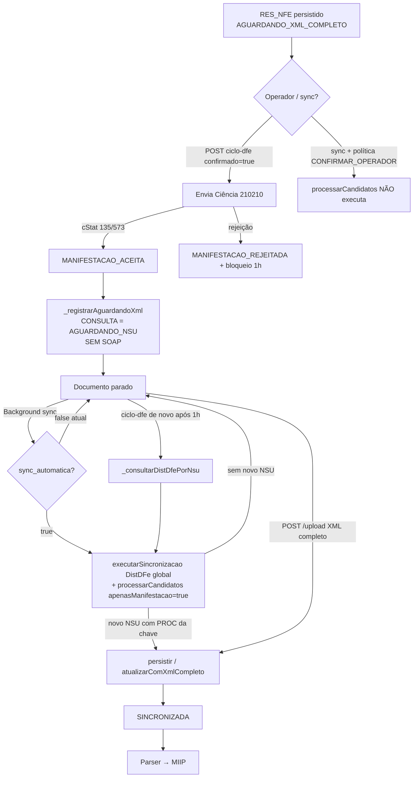

# RC7.3 — Auditoria Operacional do Recebimento do XML Completo Pós-Manifestação

**VERSÃO:** CDS Sistemas V1.0  
**MODO:** SOMENTE LEITURA — nenhuma linha de código alterada  
**Data da evidência:** 2026-07-18 / 2026-07-19  
**Banco:** `C:\ProgramData\MercantilFiscal\dados\mercadao.db`

---

## Veredito (obrigatório — Q15)

A Central Inteligente **não consulta novamente a SEFAZ de forma automática e dedicada** imediatamente após `MANIFESTACAO_ACEITA`.

O que o código faz no mesmo ciclo da aceitação é **apenas registrar** `CONSULTA_DFE_POS_MANIFESTACAO` com resultado `AGUARDANDO_NSU` (sem SOAP DistDFe).

O documento em `AGUARDANDO_XML_COMPLETO` **permanece parado** até:

1. uma **sincronização DistDFe global** (manual / abrir Central) trazer um novo NSU com `PROC_NFE` daquela chave; ou  
2. um novo `POST /:id/ciclo-dfe` **após** a janela de 1h (aí sim chama DistDFe `distNSU`); ou  
3. **upload manual** do XML completo.

Com a configuração atual (`sync_automatica_habilitada = false`), **não há timer/background** que reabra o ciclo.

---

## Respostas objetivas (1–14)

### 1. Após `MANIFESTACAO_ACEITA`, dispara automaticamente nova consulta à SEFAZ?

**NÃO.**

Evidência de código (`CentralManifestacaoDfeService.processarDocumento`):

```332:336:backend/motores/central-entradas/services/CentralManifestacaoDfeService.js
      // NT 2014.002: após Ciência, o PROC_NFE NÃO é imediato.
      // Aguarda disponibilização de novo NSU pelo Ambiente Nacional.
      if (cienciaRecemAceita || opcoes.apenasManifestacao === true) {
        return this._registrarAguardandoXml(documento, opcoes, aceita);
      }
```

`_registrarAguardandoXml` **não** chama SOAP; só grava evento `AGUARDANDO_NSU`.

Evidência de execução (doc 30):

| Evento | Resultado | Hora |
|--------|-----------|------|
| `MANIFESTACAO_ACEITA` | 135 | 23:17:46 |
| `CONSULTA_DFE_POS_MANIFESTACAO` | **AGUARDANDO_NSU** (motivo `NT_2014_002`, **sem** `modo: distNSU`) | 23:17:46 |

---

### 2. Caso SIM, qual consulta? (e o caminho que *existe* no código)

A consulta DistDFe pós-manifestação, **quando chega a executar**, é:

**(x) distNSU**

**( ) consNSU**  
**( ) consChNFe** — comentário explícito: *“nunca consChNFe imediata”*  
**( ) outra**  
**( ) nenhuma** — no momento imediato após aceitar: efetivamente nenhuma SOAP

Implementação: `_consultarDistDfePorNsu` → `sincronizarDistribuicaoDFe` → `montarXmlDistNsu`.

```361:362:backend/motores/central-entradas/services/CentralManifestacaoDfeService.js
      // Nova consulta somente via DistDFe (ultNSU), nunca consChNFe imediata.
      return this._consultarDistDfePorNsu(documento, contexto, opcoes);
```

```643:645:backend/motores/central-entradas/services/CentralManifestacaoDfeService.js
          detalhe: {
            modo: 'distNSU',
            correlationId,
```

No banco auditado: **0** eventos `CONSULTA_DFE_POS_MANIFESTACAO` com `modo: distNSU`.

---

### 3. Em qual arquivo?

| Papel | Arquivo | Método | Linhas (aprox.) |
|-------|---------|--------|-----------------|
| Gate pós-aceitação (não consulta) | `backend/motores/central-entradas/services/CentralManifestacaoDfeService.js` | `processarDocumento` | 332–336 |
| Registro “aguardando NSU” | mesmo | `_registrarAguardandoXml` | 549–586 |
| DistDFe real (quando permitido) | mesmo | `_consultarDistDfePorNsu` | 588–734 |
| Sync oficial passa candidatos **só** com `apenasManifestacao: true` | `backend/motores/central-entradas/CentralEntradasOrchestrator.js` | `executarSincronizacao` | 351–356 |
| Endpoint manual do ciclo | `backend/rotas/central-entradas.js` | `POST /:id/ciclo-dfe` | 495–513 |
| Orquestração do endpoint | `CentralEntradasOrchestrator.js` | `processarCicloDfeDocumento` | 438–450 |

---

### 4. Após manifestação aceita, o documento volta para alguma fila?

**NÃO** (não há queue/worker dedicado ao documento).

| Mecanismo | Existe para este ciclo? |
|-----------|-------------------------|
| scheduler / timer por documento | **Não** |
| queue / worker por `AGUARDANDO_XML_COMPLETO` | **Não** |
| background DistDFe global | Existe classe, mas **desligada** na config (Q5) |
| “fila” implícita | Só o status no banco; `listarPorStatus(AGUARDANDO_XML_COMPLETO)` é lido sob demanda |

`processarDocumentosPendentes` lista apenas `status = SINCRONIZADA` — documentos `AGUARDANDO_XML_COMPLETO` **não** entram nessa lista.

---

### 5. O Background Service está executando?

Config no banco (`central_entradas_config`):

| Chave | Valor |
|-------|--------|
| `sync_automatica_habilitada` | **false** |
| `sync_intervalo_minutos` | 15 |
| `sync_ao_abrir` | true |
| `manifestacao_destinatario_politica` | **CONFIRMAR_OPERADOR** |

Código (`CentralSyncBackgroundService.iniciar`):

```47:50:backend/motores/central-entradas/services/CentralSyncBackgroundService.js
    if (!this._flags.estaHabilitado() || !this._flags.syncAutomaticaHabilitada()) {
      this._ativo = false;
      return;
    }
```

| Campo | Estado (evidência) |
|-------|---------------------|
| status | **parado** (`servicoAtivo` permanece false com flag off) |
| timer ativo | **não** (`setTimeout` só após flag true) |
| scheduler ativo | **não** |
| intervalo configurado | 15 min (não aplicado enquanto flag=false) |
| última sync DistDFe registrada | `SYNC_CONCLUIDA` origem `abrir_central` em **2026-07-18 23:54:08**, `notas_novas=0` |

Boot em `server.js` chama `centralSyncBackground.iniciar()`, mas com a flag false o serviço encerra sem agendar ciclos.

---

### 6. Existe rotina automática: Aceita → aguardar → DistDFe → PROC?

**NÃO** (não há rotina automática fechada).

O que existe:

1. No mesmo `processarDocumento`, se ciência **acabou** de ser aceita → `_registrarAguardandoXml` (sem DistDFe).  
2. Sync global (`executarSincronizacao`) chama `processarCandidatos({ apenasManifestacao: true })` → **força** o mesmo early-return sem DistDFe no ciclo do documento.  
3. DistDFe global da sync pode trazer PROC **se** a SEFAZ publicar novo NSU — isso **não** é “consulta pós-manifestação do documento”; é sync de caixa de entrada.  
4. Background que repetiria a sync está **desligado**.

---

### 7. Por quê (se NÃO)?

1. Design explícito NT 2014.002: após Ciência, não consulta DistDFe na mesma passagem (`cienciaRecemAceita`).  
2. Sync oficial marca `apenasManifestacao: true`, impedindo `_consultarDistDfePorNsu` nos candidatos.  
3. Comentário no código: *“DistDFe já é responsabilidade da sincronização oficial (ultNSU)”* — mas a sync automática está off.  
4. Política `CONFIRMAR_OPERADOR` impede `processarCandidatos` automático (só roda se política = `AUTOMATICA_CIENCIA`).  
5. Janela `proximaConsultaEm` = **1 hora** (`INTERVALO_SEGURO_MS`) bloqueia nova tentativa no `ciclo-dfe` até vencer.  
6. Com `ult_nsu = max_nsu = 27`, sync posterior (23:54) trouxe **0** notas — sem novo NSU não há PROC via DistDFe.

---

### 8. Caso exista — última execução DistDFe pós-manifestação

**Não há execução registrada** de DistDFe *pós-manifestação* (`modo: distNSU` ausente em 100% dos 8 eventos `CONSULTA_DFE_POS_MANIFESTACAO`).

Última sync DistDFe global relevante:

| Campo | Valor |
|-------|--------|
| Evento | `SYNC_CONCLUIDA` id 114 |
| Origem | `abrir_central` |
| Quando | 2026-07-18 23:54:08 |
| notas_novas | **0** |
| NSU prod (`65957340000150`) | ult=**27** max=**27** ultimo_cstat=**138** (sync anterior 23:15); sync 23:54 em homolog CNPJ antigo também registrou cStat 137 no controle amb.2 |

Os 8 eventos pós-aceitação:

- resultado: `AGUARDANDO_NSU`  
- detalhe: `{ aguardandoXml: true, motivo: "NT_2014_002", proximaConsultaEm: ... }`  
- **sem** `docZip`, **sem** cStat SEFAZ de DistDFe, **sem** tipo PROC

---

### 9. Em `AGUARDANDO_XML_COMPLETO`, continua consultado automaticamente?

**Fica parado aguardando ação manual** (ou sync ao abrir Central / sync manual), **não** há poll automático por documento.

`sync_ao_abrir=true` pode disparar DistDFe global ao abrir a tela; isso **não** garante PROC da chave e **não** chama `_consultarDistDfePorNsu` enquanto `apenasManifestacao: true`.

---

### 10. Timeout / TTL / retry / backoff / reagendamento?

| Mecanismo | Existe? | Onde |
|-----------|---------|------|
| `proximaConsultaEm` (~1h) | Sim | `INTERVALO_SEGURO_MS` + detalhe do evento |
| Cooldown NSU (ult=max) | Sim | `CentralNsuService.avaliarCooldown` / `_consultarDistDfePorNsu` |
| Bloqueio 1h pós-rejeição | Sim | `_obterBloqueioRejeicao` |
| Retry automático por documento | **Não** | — |
| TTL que encerra `AGUARDANDO_XML_COMPLETO` | **Não** | — |
| Backoff progressivo | **Não** | janela fixa 1h |
| Reagendamento timer | **Não** (flag background off) | — |

`proximaConsultaEm` só é **lido** na próxima chamada a `processarDocumento`; nada agenda essa chamada sozinho.

---

### 11. Pode ficar preso indefinidamente?

**SIM.**

Porque:

- status não expira;  
- sem background;  
- sync só avança se a SEFAZ publicar **novo NSU** com o PROC;  
- se o PROC nunca entrar no stream DistDFe e ninguém fizer upload/`ciclo-dfe` após a janela, permanece `AGUARDANDO_XML_COMPLETO` / `RES_NFE` para sempre.

Evidência: docs 30–37 (e dezenas de outros) ainda `AGUARDANDO_XML_COMPLETO` após `MANIFESTACAO_ACEITA` 135.

---

### 12. Upload manual do XML do Portal — integração oficial?

**SIM.**

Fluxo:

```
POST /api/central-entradas/upload  (multer, rotas/central-entradas.js ~456)
        ↓
CentralEntradasOrchestrator.uploadDocumentos
        ↓
CentralUploadService.processarArquivo
        ↓
CentralDfePersistenciaService.persistirDocumentoDfe(origem: 'upload_manual')
        ↓  (se já existe AGUARDANDO_XML_COMPLETO + XML PROC/NFE)
CentralDocumentoAtualizacaoService.atualizarComXmlCompleto
        ↓
CentralProcessamentoService.processar  → Parser → MIIP
```

Arquivo: `backend/motores/central-entradas/services/CentralUploadService.js`.

---

### 13. Rotina: Aceita → XML disponível → importar auto → Atualizacao → Parser → MIIP?

**NÃO existe** detecção “XML disponível no Portal → importar”.

Únicos caminhos evidentes para chegar em `CentralDocumentoAtualizacaoService`:

1. DistDFe (sync global ou `_consultarDistDfePorNsu`) persistindo `PROC_NFE`/`NFE` sobre o mesmo registro;  
2. Upload manual com XML completo.

Não há watcher do Portal Nacional.

---

### 14. Cronologia REAL do sistema (código + execução)

Caso real documentado (doc **30**, cStat 135):

```
RES_NFE / DOCUMENTO_RECEBIDO          (23:15:25)
        ↓
CIENCIA_ENVIADA                       (23:17:46)
        ↓
MANIFESTACAO_ACEITA (135)             (23:17:46)
        ↓
CONSULTA_DFE_POS_MANIFESTACAO
  resultado = AGUARDANDO_NSU
  (SEM DistDFe SOAP)                  (23:17:46)
        ↓
[parada — status AGUARDANDO_XML_COMPLETO]
        ↓
(opcional) SYNC abrir_central         (23:54:08, 0 notas)
        ↓
PROC_NFE                              ← NÃO ocorreu neste caso
        ↓
Parser / MIIP                         ← NÃO ocorreu neste caso
```

Fluxo **codificado** para PROC (quando DistDFe de fato entregar o XML):

```
MANIFESTACAO_ACEITA
  → (após janela / ciclo-dfe sem apenasManifestacao)
  → _consultarDistDfePorNsu (distNSU)
  → sincronizarDistribuicaoDFe
  → persistirDocumentoDfe
  → atualizarComXmlCompleto (se PROC)
  → status SINCRONIZADA
  → processarDocumentosPendentes → Parser → MIIP
```

Esse segundo trecho **não foi executado** nos documentos aceitos auditados (sem evento `modo: distNSU`, sem `DOCUMENTO_ATUALIZADO` pós-aceitação nesses ids).

---

## Fluxograma real



---

## Timeline consolidada (ambiente)

| Hora (local DB) | O quê |
|-----------------|--------|
| 23:15:24–25 | Sync `abrir_central`: 26 notas novas; vários `RES_NFE` → `AGUARDANDO_XML_COMPLETO`; NSU 27/27 cStat 138 |
| 23:17:42–46 | 8× Ciência aceita (135) + 8× `CONSULTA … AGUARDANDO_NSU` (sem DistDFe) |
| 23:17:59 | Doc 21: Ciência rejeitada **596** (fora do escopo RC7.1, mas no mesmo lote operacional) |
| 23:54:07–08 | Sync `abrir_central` novamente: **0** notas novas |
| Até auditoria | Docs 30–37 (e outros) ainda `AGUARDANDO_XML_COMPLETO` / `RES_NFE` |

---

## Scheduler / Background / Timer / Queue / Worker

| Componente | Classe / local | Estado observado |
|------------|----------------|------------------|
| Background | `CentralSyncBackgroundService` | **Inativo** (`sync_automatica_habilitada=false`) |
| Timer | `setTimeout` em `_agendarCiclo` | **Não armado** |
| Scheduler | mesmo serviço | **Não** |
| Queue | — | **Não há** fila de “aguardando XML” |
| Worker | — | **Não há** worker dedicado |
| Sync ao abrir | `sincronizarAoAbrir` | **Ativo** (`sync_ao_abrir=true`) — DistDFe global sob demanda de UI |
| Mutex DistDFe | `CentralSyncExecucaoService.comLockDistDfe` | Existe; não substitui scheduler |

---

## Conclusão técnica

O bloqueio operacional **não** está em Parser, MIIP, Compras, máquina de estados, RC6.3/6.5/6.9 nem na comunicação DistDFe em si.

Está no **desenho do ciclo pós-aceitação**:

1. Aceitar Ciência **não** dispara DistDFe.  
2. O evento `CONSULTA_DFE_POS_MANIFESTACAO` imediato é **apenas marcador** (`AGUARDANDO_NSU`).  
3. A retomada automática via background **está desligada**.  
4. A sync oficial, quando roda, trata candidatos com `apenasManifestacao: true` (não força DistDFe do ciclo).  
5. Com `ultNSU == maxNSU` e 0 notas novas, o XML completo **não entra** mesmo que esteja no Portal.  
6. Upload manual **está** integrado; DistDFe pós-manifestação dedicado **quase nunca** roda na prática atual (0 evidências `modo: distNSU`).

**Resposta final (Q15):** o documento **permanece aguardando** até ação manual (sync / ciclo-dfe após janela / upload) ou até um DistDFe global eventual trazer o PROC em novo NSU — **não** há consulta SEFAZ automática garantida após `MANIFESTACAO_ACEITA`.
