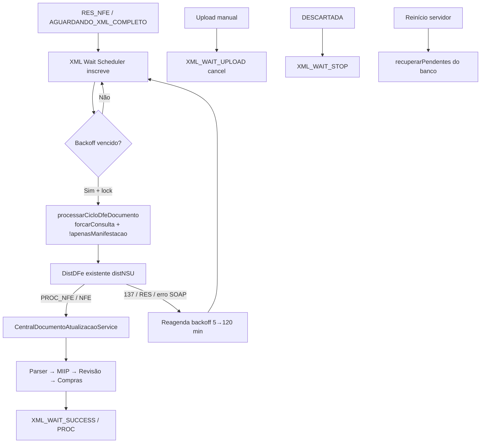

# RC7.4 — Scheduler Inteligente de Recuperação Automática do XML Completo

**VERSÃO:** CDS Sistemas V1.0  
**MODO:** IMPLEMENTAÇÃO  
**Data:** 2026-07-18  

## Objetivo alcançado

Documentos em `AGUARDANDO_XML_COMPLETO` + `RES_NFE` passam a ser acompanhados automaticamente pelo **XML Wait Scheduler**, integrado ao `CentralSyncBackgroundService`, até a chegada do `PROC_NFE` — sem intervenção manual.

Escopo respeitado: sem alterações em DistDFe, Manifestação, Parser, MIIP, Compras, Registry, UrlResolver, SOAP, schema de banco, APIs de negócio ou Máquina de Estados.

---

## Arquivos criados

| Arquivo | Função |
|---------|--------|
| `backend/motores/central-entradas/services/CentralXmlWaitScheduler.js` | Scheduler + backoff + lock + telemetria + persistência KV |
| `tests/central-entradas/rc74-xml-wait-scheduler.test.js` | Testes unitários |
| `docs/RC7.4_SCHEDULER_XML_COMPLETO.md` | Este relatório |

## Arquivos alterados

| Arquivo | Mudança |
|---------|---------|
| `CentralSyncBackgroundService.js` | Inicia XML Wait mesmo com `sync_automatica` off |
| `CentralUploadService.js` | Cancela wait no upload (`XML_WAIT_UPLOAD`) |
| `CentralEntradasOrchestrator.js` | Expõe `documento.xmlWait` no detalhe |
| `CentralDashboardService.js` | Telemetria `xmlWait` no dashboard |
| `CentralDiagnosticoService.js` | `scheduler.xmlWait` no diagnóstico |
| `frontend/erp/js/central-entradas.js` | Info operacional no alerta (sem mudar layout) |
| `tests/.../rc731-background-smoke.test.js` | Mock do xmlWait + motivo atualizado |

Persistência: chave existente `central_entradas_config.xml_wait_scheduler_state` (tipo JSON) — **sem migration/schema**.

---

## Fluxograma atualizado



---

## Regras operacionais

| Regra | Implementação |
|-------|----------------|
| Filtro | `AGUARDANDO_XML_COMPLETO` + `RES_NFE` |
| Backoff | 5 → 10 → 20 → 30 → 60 → **120 min** (teto) |
| Lock | `Set` por `documentoId` — 1 consulta/tick |
| Idempotência | inscrição única no Map + estado persistido |
| Upload | `cancelar(id, 'upload')` |
| Cancelado | status `DESCARTADA` → stop |
| Boot | `recuperarPendentes` no `iniciar()` |
| Timeout log | alerta `XML_WAIT_TIMEOUT` após 24h **sem parar** as tentativas |

---

## Logs

`XML_WAIT_START` · `XML_WAIT_RETRY` · `XML_WAIT_SUCCESS` · `XML_WAIT_TIMEOUT` · `XML_WAIT_STOP` · `XML_WAIT_UPLOAD` · `XML_WAIT_PROC`

Campos: CorrelationId, DocumentoId, NSU, Chave, Tempo, Tentativa, Próxima execução, Motivo.

---

## Painel

No resumo do documento (`AGUARDANDO_XML_COMPLETO`):

- Aguardando XML  
- Próxima tentativa  
- Última consulta  
- Tentativas  
- Tempo aguardando  

Sem mudança de layout estrutural.

---

## Testes executados

```
node tests/central-entradas/rc74-xml-wait-scheduler.test.js  → OK
node tests/central-entradas/rc731-background-smoke.test.js   → (atualizado)
```

Cobertura: backoff, retry sem PROC (137), sucesso PROC, cancel upload, recuperação boot, lock anti-duplicata.

---

## Telemetria

`obterTelemetria()`:

- documentosAguardando  
- documentosRecuperados  
- tempoMedioRecuperacaoMs  
- numeroTentativas  
- taxaSucesso / taxaTimeout  

Disponível em dashboard (`xmlWait`) e diagnóstico (`scheduler.xmlWait`).

---

## Confirmação de não-regressão

| Área | Status |
|------|--------|
| Parser | Não alterado |
| MIIP | Não alterado |
| Compras | Não alterado |
| Manifestação | Não alterado (usa opções já existentes `forcarConsulta` / `apenasManifestacao`) |
| DistDFe | Não alterado (reutiliza `sincronizarDistribuicaoDFe` via ciclo oficial) |
| Schema DB | Não alterado |

---

## Critérios de aceitação

| Critério | Status |
|----------|--------|
| Documento não fica preso sem nova consulta | ✓ scheduler periódico |
| Cooldown / backoff | ✓ |
| Upload cancela wait | ✓ |
| Reinício recupera pendentes | ✓ |
| Sem segundo serviço concorrente | ✓ integrado ao Background |
| Sem regressão Parser/MIIP/Compras/Manifestação/DistDFe | ✓ |

**Nota operacional:** após restart do backend, o XML Wait inicia automaticamente no boot (`server.js` → `centralSyncBackground.iniciar()`), mesmo com `sync_automatica_habilitada=false`.
