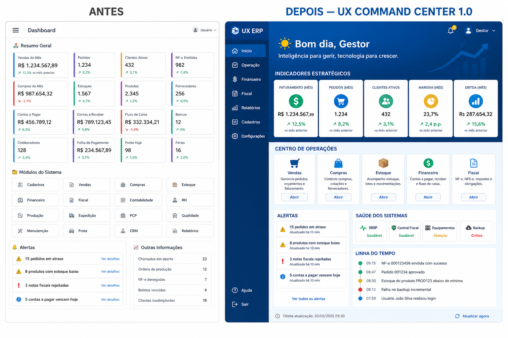

# UX COMMAND CENTER 1.0 — Dashboard CDS Sistemas

**Produto:** CDS Sistemas V1.0  
**Tipo:** Sprint exclusiva de UX/UI  
**Data:** 2026-07-10  
**Escopo:** `frontend/erp/pages/dashboard.html` · `frontend/css/dashboard-command.css` · `frontend/erp/js/dashboard-command.js` · adaptações mínimas em `dashboard.js` / `index.html`

---

## Critério de aceite

Ao abrir o CDS Sistemas, o gestor vê um **Centro de Comando** com hierarquia clara e alinhado ao slogan:

> CDS Sistemas — Inteligência para gerir, tecnologia para crescer.

**Nenhuma funcionalidade de negócio foi alterada.**

---

## O que NÃO foi alterado

| Área | Status |
|---|---|
| Backend | Intacta |
| Banco / SQL | Intacta |
| APIs (`/dashboard/resumo`, vencimentos, alertas) | Intactas |
| Cálculo de KPIs no servidor | Intacta |
| Parser / MIIP / Central / Fiscal Platform | Intactos |
| Gráficos / sparkline / heatmap | Não implementados (DASH 2.0) |
| Animações | Não implementadas |

---

## Nova estrutura

| Bloco | Conteúdo |
|---|---|
| **Hero** | Saudação + nome, data completa, status da empresa, slogan, filtros à direita |
| **1 · KPIs** | 5 cards iguais: Faturamento, Vendas, Lucro, Ticket Médio, Crescimento* |
| **2 · Operação** | PDV, Financeiro, Compras, Fiscal, Central — indicador + resumo + Abrir |
| **3 · Alertas** | Caixa única, ordenada por prioridade |
| **4 · Saúde** | MIIP, Central, Fiscal, Equipamentos, Backup (OK / Atenção) |
| **5 · Atividade** | Timeline a partir dos dados já carregados |
| **Detalhes** | Listas legadas recolhíveis (mesmos IDs / mesmos dados) |

\* **Crescimento** é derivado só no cliente: faturamento de hoje vs média diária do período já retornado pela API. Sem endpoint novo.

---

## Componentes

| Componente | Arquivo |
|---|---|
| `DashboardHero` | `dashboard-command.js` |
| `DashboardSection` | marcação HTML |
| `DashboardKPI` | HTML + helper crescimento |
| `DashboardOperationCard` | HTML + helper |
| `DashboardAlert` | `dashboard-command.js` |
| `DashboardHealth` | `dashboard-command.js` |
| `DashboardTimeline` | `dashboard-command.js` |

---

## Comparativo Antes × Depois

| Dimensão | Antes (RC1) | Depois (CC 1.0) |
|---|---|---|
| Superfície | ~27 cards soltos | 5 blocos + detalhes recolhíveis |
| Hierarquia | Fraca | Hero → KPI → Operação/Alertas → Saúde/Timeline |
| Identidade | “Dashboard” genérico | Slogan + marca no hero |
| Decisão em 5s | Difícil | Status + alertas + 5 KPIs |
| Cores | Aleatórias (roxo, laranja…) | Azul / verde / amarelo / vermelho / cinza |
| CTAs de módulo | 1 (equipamentos) | 5 (PDV, Fin, Compras, Fiscal, Central) |
| Gráficos | 0 | 0 (proposital) |

**Mock visual:**

---

## Checklist de verificação

- [ ] Abrir ERP → Dashboard carrega sem erro de console
- [ ] Filtro 7 / Hoje / 30 / Personalizado continua atualizando KPIs de período
- [ ] Modo fiscal (F12) continua refletindo nos valores (mesma API)
- [ ] Botões Abrir navegam para PDV / Financeiro / Compras / Fiscal / Central
- [ ] Alertas consolidam estoque, sync, backup, contas, vencimentos
- [ ] “Detalhes do período” ainda lista mais/menos vendidos, formas, backups, auditoria
- [ ] Layout responsivo (desktop / tablet / mobile)
- [ ] Nenhuma chamada de API nova no Network (exceto as já existentes)

---

## Arquivos entregues

- `frontend/erp/pages/dashboard.html` — nova estrutura
- `frontend/css/dashboard-command.css` — sistema visual
- `frontend/erp/js/dashboard-command.js` — componentes
- `frontend/erp/js/dashboard.js` — hooks `atualizarCommandCenter*` (sem mudar fetch)
- `frontend/erp/index.html` — CSS + script
- `docs/UX_COMMAND_CENTER_1.0.md` — este checklist

---

## UX COMMAND CENTER 1.0 CONCLUÍDO

Confirmação: **zero alteração funcional** de backend, APIs, SQL, KPIs calculados no servidor, Parser, MIIP, Central Inteligente ou Plataforma Fiscal. Apenas arquitetura visual, componentização e responsividade do Dashboard principal.
