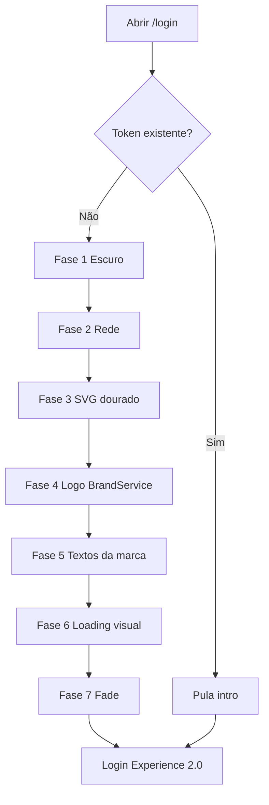
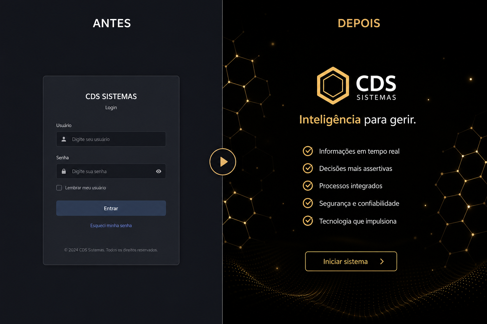

# UX INTRO EXPERIENCE 1.0 — CDS Sistemas

**Produto:** CDS Sistemas V1.0  
**Tipo:** Experiência visual de abertura  
**Tempo máximo:** **2,0 segundos**  
**Data:** 2026-07-11

---

## Critério de aceite

Ao abrir o CDS Sistemas, o usuário percebe imediatamente uma **Plataforma Inteligente de Gestão** moderna e premium — sem atrasar o acesso.

**Zero alteração funcional** (auth, login, backend, banco, APIs, Electron, ACL, segurança).

---

## Arquivos

```
frontend/shared/intro/
  intro.html
  intro.css
  intro.js
  intro-animator.js
```

Integração visual em `login.html` + espera em `login-experience.js` (sem mudar autenticação).

---

## Componentes

| Componente | Responsabilidade |
|---|---|
| `IntroScene` | Fases 1–7 / fade-out |
| `NetworkAnimator` | Pontos luminosos (rede) |
| `LogoAnimator` | Traço SVG dourado do símbolo |
| `BrandAnimator` | Logo + textos via BrandService |
| `LoadingSequence` | Checklist visual inferior |

---

## Timeline (≤ 2000 ms)

| Fase | t (ms) | Conteúdo |
|---|---|---|
| 1 | 0 | Tela escura + gradiente discreto |
| 2 | 180 | Rede de pontos |
| 3 | 420 | Linhas douradas SVG |
| 4 | 900 | Fade-in logo (BrandService) |
| 5 | 1180 | Nome / subtítulo / slogan / versão |
| 6 | 1450 | Mensagens ✓ (somente visual) |
| 7 | 1850–2000 | Fade → login |

---

## Fluxograma



---

## Comparativo



| Antes | Depois |
|---|---|
| Abertura estática / fade simples do login | Sequência oficial de marca ≤ 2 s |
| Sem símbolo animado | SVG dourado + rede inteligente |
| Textos mistos | 100% BrandService |

---

## Performance / restrições

- Apenas `opacity`, `transform`, `blur`, `scale`, `translate`
- Sem vídeo, GIF, canvas pesado ou libs externas
- `prefers-reduced-motion`: atalho visual rápido
- Hardware-friendly (`translateZ(0)`, `will-change` no root)

---

## UX INTRO EXPERIENCE 1.0 CONCLUÍDO

Confirmação: nenhuma lógica de autenticação, sessão, backend, banco, API, Electron, ACL ou regra de negócio foi alterada.
