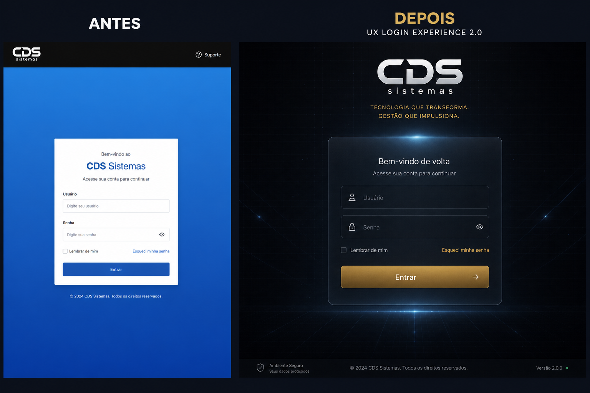

# UX LOGIN EXPERIENCE 2.0 — CDS Sistemas

**Produto:** CDS Sistemas V1.0  
**Tipo:** Sprint exclusiva de UX/UI  
**Data:** 2026-07-11

---

## Critério de aceite

Ao abrir o sistema, o usuário sente que entra em uma **Plataforma Inteligente de Gestão** moderna, premium e confiável — sem exageros.

**Zero alteração funcional** de autenticação, sessão, backend, banco, APIs, Electron, ACL ou segurança.

---

## Arquivos

| Arquivo | Papel |
|---|---|
| `frontend/shared/login.html` | Nova estrutura (hero + glass + footer + splash) |
| `frontend/css/login-experience.css` | Fundo, intro, glass, campos, botão, boot |
| `frontend/shared/js/login-experience.js` | Branding + intro + splash rotativo |
| `frontend/shared/js/login.js` | Mesmo `/auth/login`; UX de loading/splash |
| `frontend/css/splash.css` | Alinhamento visual do splash |
| `frontend/shared/js/brand-service.js` | `VERSAO` |
| `assets/branding/BrandService.js` | `VERSAO` |
| Labels F12 removidos da UI cliente | dashboard, sidebar, helpers, core |

---

## Sequência de entrada

1. Fade-in / logo / glow / slogan / card — **≤ 1,5 s** (opacity + transform)  
2. Login glassmorphism leve  
3. Após Entrar (sucesso): splash visual **~800 ms** com mensagens rotativas  
4. Redirect para o mesmo destino de antes (`obterDestinoPosLogin`)

Mensagens do splash são **somente visuais**.

---

## Tempos

| Etapa | Alvo |
|---|---|
| Intro até card visível | ≈ 1,25–1,5 s |
| Splash pós-login | ≈ 800 ms |
| Animações | `opacity` / `transform` apenas |

---

## Removido da UI do cliente

- “Somente fiscal (F12)” e equivalentes com atalho  
- Fundo com logo repetida (substituído por stage CSS premium)  
- Textos fixos de marca (passam pelo BrandService)

Atalho F12 **continua funcionando** — apenas não é anunciado na interface.

---

## Comparativo

| Antes | Depois |
|---|---|
| Card branco clássico | Glass leve + hero central |
| Fundo com imagem/logo | Preto profundo + grid + partículas |
| Entrada imediata no ERP | Splash de apresentação ~800 ms |
| Textos mistos | BrandService exclusivo |

---

## Compatibilidade

- Electron (renderer): mesma página `/login`, sem mudança no main process  
- Web: CSS + JS estáticos  
- Responsivo: 1366 → 4K (shell fluido)  
- A11y: labels, focus-visible, tab/enter, contraste AA no card

---

## UX LOGIN EXPERIENCE 2.0 CONCLUÍDO

Confirmação: autenticação, sessão, backend, banco, APIs, Electron, ACL e segurança **não foram alterados**.
